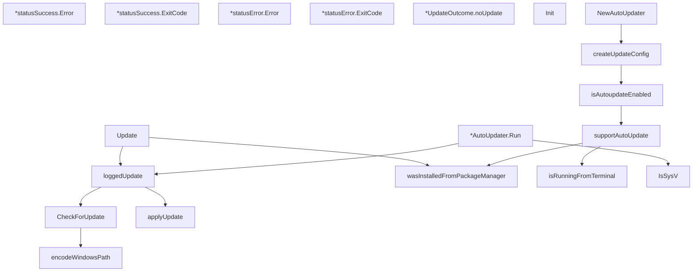

# Behavior Atom: cmd/cloudflared/updater/update.go

## Source Anchor

- Go source: [cloudflare/cloudflared@2026.3.0/cmd/cloudflared/updater/update.go](https://github.com/cloudflare/cloudflared/blob/2026.3.0/cmd/cloudflared/updater/update.go)
- Package: updater
- Module group: cmd

## Behavioral Responsibility

CLI command routing and operator-facing behavior surface.

## Entry Points

- (*statusSuccess) Error() string (line 47)
- (*statusSuccess) ExitCode() int (line 51)
- (*statusError) Error() string (line 60)
- (*statusError) ExitCode() int (line 64)
- Init(info *cliutil.BuildInfo) (line 87)
- CheckForUpdate(options updateOptions) (CheckResult, error) (line 91)
- Update(c *cli.Context) error (line 136)
- NewAutoUpdater(updateDisabled bool, freq time.Duration, listeners *gracenet.Net, log*zerolog.Logger) *AutoUpdater (line 214)
- (*AutoUpdater) Run(ctx context.Context) error (line 240)
- IsSysV() bool (line 304)

## Internal Function Surface

- (*UpdateOutcome) noUpdate() bool (line 83)
- encodeWindowsPath(path string) string (line 112)
- applyUpdate(options updateOptions, update CheckResult) UpdateOutcome (line 122)
- loggedUpdate(log *zerolog.Logger, options updateOptions) UpdateOutcome (line 183)
- createUpdateConfig(updateDisabled bool, freq time.Duration, log *zerolog.Logger)*configurable (line 222)
- isAutoupdateEnabled(log *zerolog.Logger, updateDisabled bool, updateFreq time.Duration) bool (line 270)
- supportAutoUpdate(log *zerolog.Logger) bool (line 277)
- wasInstalledFromPackageManager() bool (line 295)
- isRunningFromTerminal() bool (line 300)

## Input Contract

- CLI flags and command arguments
- func-param:c *cli.Context
- func-param:ctx context.Context
- func-param:freq time.Duration
- func-param:info *cliutil.BuildInfo
- func-param:listeners *gracenet.Net
- func-param:log *zerolog.Logger
- func-param:options updateOptions
- func-param:path string
- func-param:update CheckResult
- func-param:updateDisabled bool
- func-param:updateFreq time.Duration

## Output Contract

- return:*AutoUpdater
- return:*configurable
- return:CheckResult
- return:UpdateOutcome
- return:bool
- return:error
- return:int
- return:string
- stdout/stderr or structured logs

## Side Effects and State Transitions

- timers and scheduling

## Branching and Failure Semantics

- Branch density: if=26, switch=0, select=1
- error-return paths

## Import and Dependency Surface

- context
- fmt
- github.com/cloudflare/cloudflared/cmd/cloudflared/cliutil
- github.com/cloudflare/cloudflared/cmd/cloudflared/flags
- github.com/cloudflare/cloudflared/config
- github.com/cloudflare/cloudflared/logger
- github.com/facebookgo/grace/gracenet
- github.com/rs/zerolog
- github.com/urfave/cli/v2
- golang.org/x/term
- os
- path/filepath
- runtime
- strings
- time

## Go-Impl Flow (Intra-file)

## Rust Porting Notes

- **Auto-updater**: `NewAutoUpdater()` creates a scheduled update loop → `tokio::time::interval()` loop with `check_and_apply()` on each tick.
- **Platform support check**: `supportAutoUpdate()` guards by OS → `#[cfg(not(target_os = "windows"))]` or runtime check.
- **Graceful restart**: `gracenet` for seamless binary replacement → use `listenfd` crate or exec-based restart on Unix; Windows requires the batch-file workaround.
- **Quirk — 26 if-branches + 1 select**: Complex update orchestration; decompose into `check()`, `download()`, `apply()`, `restart()` steps.

## Accuracy Notes

- Generated from Go AST parsing and source text pattern extraction.
- Source link is authoritative for disputed semantics; keep this atom synchronized with the linked file.
