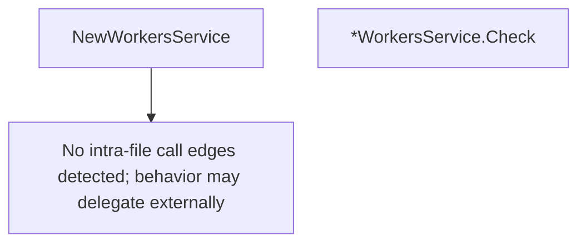

# Behavior Atom: cmd/cloudflared/updater/workers_service.go

## Source Anchor

- Go source: [cloudflare/cloudflared@2026.3.0/cmd/cloudflared/updater/workers_service.go](https://github.com/cloudflare/cloudflared/blob/2026.3.0/cmd/cloudflared/updater/workers_service.go)
- Package: updater
- Module group: cmd

## Behavioral Responsibility

CLI command routing and operator-facing behavior surface.

## Entry Points

- NewWorkersService(currentVersion string, url string, targetPath string, opts Options) Service (line 44)
- (*WorkersService) Check() (CheckResult, error) (line 54)

## Internal Function Surface

- None detected.

## Input Contract

- func-param:currentVersion string
- func-param:opts Options
- func-param:targetPath string
- func-param:url string

## Output Contract

- return:CheckResult
- return:Service
- return:error

## Side Effects and State Transitions

- network I/O

## Branching and Failure Semantics

- Branch density: if=8, switch=0, select=0
- error-return paths

## Import and Dependency Surface

- encoding/json
- errors
- fmt
- net/http
- runtime

## Go-Impl Flow (Intra-file)

## Rust Porting Notes

- **HTTP version check**: `NewWorkersService()` + `Check()` queries a Workers endpoint for latest version → `reqwest::Client::get(url).send().await?.json::<VersionResponse>().await`.
- **Quirk — 8 if-branches**: HTTP response validation; use `?` on `reqwest::Response::error_for_status()` + JSON parsing.

## Accuracy Notes

- Generated from Go AST parsing and source text pattern extraction.
- Source link is authoritative for disputed semantics; keep this atom synchronized with the linked file.
