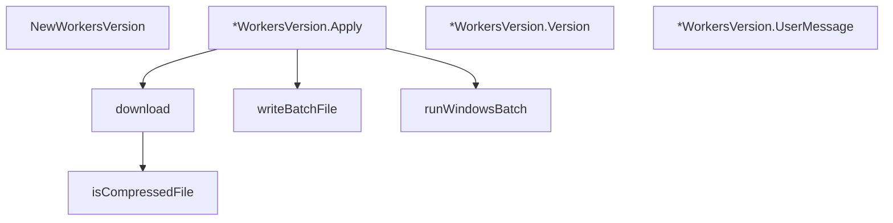

# Behavior Atom: cmd/cloudflared/updater/workers_update.go

## Source Anchor

- Go source: [cloudflare/cloudflared@2026.3.0/cmd/cloudflared/updater/workers_update.go](https://github.com/cloudflare/cloudflared/blob/2026.3.0/cmd/cloudflared/updater/workers_update.go)
- Package: updater
- Module group: cmd

## Behavioral Responsibility

CLI command routing and operator-facing behavior surface.

## Entry Points

- NewWorkersVersion(url string, version string, checksum string, targetPath string, userMessage string, isCompressed bool) CheckResult (line 69)
- (*WorkersVersion) Apply() error (line 83)
- (*WorkersVersion) Version() string (line 146)
- (*WorkersVersion) UserMessage() string (line 152)

## Internal Function Surface

- download(url string, filepath string, isCompressed bool) error (line 157)
- isCompressedFile(urlstring string) bool (line 200)
- writeBatchFile(targetPath string, newPath string, oldPath string) error (line 214)
- runWindowsBatch(batchFile string) error (line 242)

## Input Contract

- func-param:batchFile string
- func-param:checksum string
- func-param:filepath string
- func-param:isCompressed bool
- func-param:newPath string
- func-param:oldPath string
- func-param:targetPath string
- func-param:url string
- func-param:urlstring string
- func-param:userMessage string
- func-param:version string

## Output Contract

- filesystem writes
- return:CheckResult
- return:bool
- return:error
- return:string

## Side Effects and State Transitions

- network I/O
- filesystem I/O
- subprocess execution

## Branching and Failure Semantics

- Branch density: if=18, switch=0, select=0
- error-return paths

## Import and Dependency Surface

- archive/tar
- compress/gzip
- errors
- fmt
- github.com/cloudflare/cloudflared/cmd/cloudflared/cliutil
- github.com/getsentry/sentry-go
- io
- net/http
- net/url
- os
- os/exec
- path
- path/filepath
- runtime
- text/template
- time

## Go-Impl Flow (Intra-file)

## Rust Porting Notes

- **Binary download + extraction**: `download()` fetches tar.gz, extracts binary → `reqwest` for download + `flate2::read::GzDecoder` + `tar::Archive` for extraction.
- **Windows batch workaround**: `writeBatchFile()` + `runWindowsBatch()` for self-replacement on Windows → `#[cfg(windows)]` with `std::process::Command::new("cmd").args(&["/C", batch_path])`.
- **Unix symlink update**: Binary swap via atomic rename → `std::fs::rename()` for atomic file replacement.
- **Quirk — 18 if-branches**: OS-specific branches; use `#[cfg]` to separate Windows and Unix paths clearly.

## Accuracy Notes

- Generated from Go AST parsing and source text pattern extraction.
- Source link is authoritative for disputed semantics; keep this atom synchronized with the linked file.
