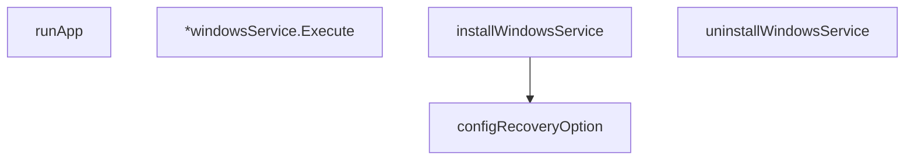

# Behavior Atom: cmd/cloudflared/windows_service.go

## Source Anchor

- Go source: [cloudflare/cloudflared@2026.3.0/cmd/cloudflared/windows_service.go](https://github.com/cloudflare/cloudflared/blob/2026.3.0/cmd/cloudflared/windows_service.go)
- Package: main
- Module group: cmd

## Behavioral Responsibility

CLI command routing and operator-facing behavior surface.

## Entry Points

- (*windowsService) Execute(serviceArgs []string, r <-chan svc.ChangeRequest, statusChan chan<- svc.Status) (ssec bool, errno uint32) (line 106)

## Internal Function Surface

- runApp(app *cli.App, graceShutdownC chan struct{}) (line 45)
- installWindowsService(c *cli.Context) error (line 176)
- uninstallWindowsService(c *cli.Context) error (line 228)
- configRecoveryOption(handle windows.Handle) error (line 303)

## Input Contract

- CLI flags and command arguments
- func-param:app *cli.App
- func-param:c *cli.Context
- func-param:graceShutdownC chan struct{}
- func-param:handle windows.Handle
- func-param:r <-chan svc.ChangeRequest
- func-param:serviceArgs []string
- func-param:statusChan chan<- svc.Status

## Output Contract

- return:errno uint32
- return:error
- return:ssec bool
- stdout/stderr or structured logs

## Side Effects and State Transitions

- network I/O
- subprocess execution
- concurrency primitives

## Branching and Failure Semantics

- Branch density: if=23, switch=1, select=1
- error-return paths
- fatal log/termination paths
- fallback/default branches

## Import and Dependency Surface

- fmt
- github.com/cloudflare/cloudflared/cmd/cloudflared/cliutil
- github.com/cloudflare/cloudflared/logger
- github.com/pkg/errors
- github.com/urfave/cli/v2
- golang.org/x/sys/windows
- golang.org/x/sys/windows/svc
- golang.org/x/sys/windows/svc/eventlog
- golang.org/x/sys/windows/svc/mgr
- os
- syscall
- time
- unsafe

## Go-Impl Flow (Intra-file)

## Accuracy Notes

- Generated from Go AST parsing and source text pattern extraction.
- Source link is authoritative for disputed semantics; keep this atom synchronized with the linked file.

## Rust Porting Notes

- **Windows service**: `golang.org/x/sys/windows/svc` service control → `windows-service` crate with `ServiceControlHandler` and `ServiceMain` entry point.
- **Service Control Manager**: `svc/mgr` for service installation/removal → `windows-service::service_manager::ServiceManager` API.
- **Event logging**: `svc/eventlog` → `eventlog` crate or `tracing-eventlog` subscriber for Windows Event Log.
- **Platform gate**: Entire file is `//go:build windows` → `#[cfg(target_os = "windows")]` module with conditional compilation.
- **Unsafe syscalls**: `unsafe` + `syscall` for Windows handles → `windows-sys` crate typed bindings; minimize `unsafe` blocks.
- **Quirk — change request select**: `select` on `svc.ChangeRequest` channel → `tokio::sync::mpsc::Receiver` with service status updates in a `tokio::select!` loop.
- **Quirk — 23 if-branches**: Dense error handling around service lifecycle — model as a state machine enum (`Installing`, `Starting`, `Running`, `Stopping`) in Rust.
