# Behavior Atom: config/configuration.go

## Source Anchor

- Go source: [cloudflare/cloudflared@2026.3.0/config/configuration.go](https://github.com/cloudflare/cloudflared/blob/2026.3.0/config/configuration.go)
- Package: config
- Module group: config

## Behavioral Responsibility

Configuration, identity, and credential handling behavior.

## Entry Points

- DefaultConfigDirectory() string (line 47)
- DefaultLogDirectory() string (line 62)
- DefaultConfigPath() string (line 70)
- DefaultConfigSearchDirectories() []string (line 79)
- FileExists(path string) (bool, error) (line 89)
- FindDefaultConfigPath() string (line 105)
- FindOrCreateConfigPath() string (line 123)
- ValidateUnixSocket(c *cli.Context) (string, error) (line 156)
- ValidateUrl(c *cli.Context, allowURLFromArgs bool) (*url.URL, error) (line 165)
- (*Configuration) Source() string (line 275)
- (*configFileSettings) Int(name string) (int, error) (line 279)
- (*configFileSettings) Duration(name string) (time.Duration, error) (line 289)
- (*configFileSettings) Float64(name string) (float64, error) (line 302)
- (*configFileSettings) String(name string) (string, error) (line 312)
- (*configFileSettings) StringSlice(name string) ([]string, error) (line 322)
- (*configFileSettings) IntSlice(name string) ([]int, error) (line 340)
- (*configFileSettings) Generic(name string) (cli.Generic, error) (line 361)
- (*configFileSettings) Bool(name string) (bool, error) (line 365)
- GetConfiguration() *Configuration (line 377)
- ReadConfigFile(c *cli.Context, log*zerolog.Logger) (settings *configFileSettings, warnings string, err error) (line 384)
- (CustomDuration) MarshalJSON() ([]byte, error) (line 434)
- (*CustomDuration) UnmarshalJSON(data []byte) error (line 438)
- (*CustomDuration) MarshalYAML() (interface{}, error) (line 448)
- (*CustomDuration) UnmarshalYAML(unmarshal func(interface{}) error) error (line 452)

## Internal Function Surface

- None detected.

## Input Contract

- CLI flags and command arguments
- environment variables
- func-param:allowURLFromArgs bool
- func-param:c *cli.Context
- func-param:data []byte
- func-param:log *zerolog.Logger
- func-param:name string
- func-param:path string
- func-param:unmarshal func(interface{}) error

## Output Contract

- filesystem writes
- return:*Configuration
- return:*url.URL
- return:[]byte
- return:[]int
- return:[]string
- return:bool
- return:cli.Generic
- return:err error
- return:error
- return:float64
- return:int
- return:interface{}
- return:settings *configFileSettings
- return:string
- return:time.Duration
- return:warnings string
- stdout/stderr or structured logs

## Side Effects and State Transitions

- network I/O
- filesystem I/O

## Branching and Failure Semantics

- Branch density: if=42, switch=1, select=0
- error-return paths

## Import and Dependency Surface

- encoding/json
- fmt
- github.com/cloudflare/cloudflared/validation
- github.com/mitchellh/go-homedir
- github.com/pkg/errors
- github.com/rs/zerolog
- github.com/urfave/cli/v2
- gopkg.in/yaml.v3
- io
- net/url
- os
- path/filepath
- runtime
- strconv
- time

## Go-Impl Flow (Intra-file)

```mermaid
flowchart TD
    F1["DefaultConfigDirectory"]
    F2["DefaultLogDirectory"]
    F3["DefaultConfigPath"]
    F4["DefaultConfigSearchDirectories"]
    F5["FileExists"]
    F6["FindDefaultConfigPath"]
    F7["FindOrCreateConfigPath"]
    F8["ValidateUnixSocket"]
    F9["ValidateUrl"]
    F10["*Configuration.Source"]
    F11["*configFileSettings.Int"]
    F12["*configFileSettings.Duration"]
    F13["*configFileSettings.Float64"]
    F14["*configFileSettings.String"]
    F15["*configFileSettings.StringSlice"]
    F16["*configFileSettings.IntSlice"]
    F17["*configFileSettings.Generic"]
    F18["*configFileSettings.Bool"]
    F19["GetConfiguration"]
    F20["ReadConfigFile"]
    F21["CustomDuration.MarshalJSON"]
    F22["*CustomDuration.UnmarshalJSON"]
    F23["*CustomDuration.MarshalYAML"]
    F24["*CustomDuration.UnmarshalYAML"]
    F2 --> F1
    F3 --> F1
    F6 --> F4
    F6 --> F5
    F7 --> F6
    F7 --> F3
    F7 --> F2
```

## Accuracy Notes

- Generated from Go AST parsing and source text pattern extraction.
- Source link is authoritative for disputed semantics; keep this atom synchronized with the linked file.

## Rust Porting Notes

- **Config discovery**: `FindDefaultConfigPath` platform-conditional path search → `dirs::config_dir()` + platform-specific fallbacks via `#[cfg(target_os)]`.
- **YAML parsing**: `gopkg.in/yaml.v3` two-pass decode → `serde_yaml::from_reader` with `#[derive(Deserialize)]` config struct.
- **CustomDuration**: JSON serializes as integer seconds, YAML as Go duration string — implement `serde::Serialize`/`Deserialize` with `#[serde(deserialize_with)]` for dual-format handling. This is the **highest-risk serialization asymmetry** in the entire codebase.
- **CLI integration**: `configFileSettings` wrapping YAML values for `urfave/cli` → `clap` config file support via `config` crate or manual layered config.
- **Socket validation**: `ValidateUnixSocket` → `std::os::unix::net::UnixListener::bind` probe; guard with `#[cfg(unix)]`.
- **URL validation**: `ValidateUrl` with scheme/host normalization → `url::Url::parse` with custom validation logic.
- **Quirk — 42 if-branches**: Dense conditional logic in config parsing and validation; extract into typed builder with validation methods.
- **Quirk — GetConfiguration singleton**: Go package-level `sync.Once`-guarded singleton → `std::sync::OnceLock<Configuration>` or `once_cell::sync::Lazy`.
