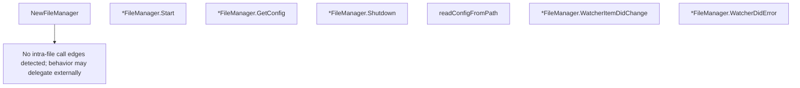

# Behavior Atom: config/manager.go

## Source Anchor

- Go source: [cloudflare/cloudflared@2026.3.0/config/manager.go](https://github.com/cloudflare/cloudflared/blob/2026.3.0/config/manager.go)
- Package: config
- Module group: config

## Behavioral Responsibility

Configuration, identity, and credential handling behavior.

## Entry Points

- NewFileManager(watcher watcher.Notifier, configPath string, log *zerolog.Logger) (*FileManager, error) (line 36)
- (*FileManager) Start(notifier Notifier) error (line 48)
- (*FileManager) GetConfig() (Root, error) (line 63)
- (*FileManager) Shutdown() (line 68)
- (*FileManager) WatcherItemDidChange(filepath string) (line 99)
- (*FileManager) WatcherDidError(err error) (line 110)

## Internal Function Surface

- readConfigFromPath(configPath string, log *zerolog.Logger) (Root, error) (line 72)

## Input Contract

- func-param:configPath string
- func-param:err error
- func-param:filepath string
- func-param:log *zerolog.Logger
- func-param:notifier Notifier
- func-param:watcher watcher.Notifier

## Output Contract

- return:*FileManager
- return:Root
- return:error
- stdout/stderr or structured logs

## Side Effects and State Transitions

- filesystem I/O

## Branching and Failure Semantics

- Branch density: if=6, switch=0, select=0
- error-return paths

## Import and Dependency Surface

- github.com/cloudflare/cloudflared/watcher
- github.com/pkg/errors
- github.com/rs/zerolog
- gopkg.in/yaml.v3
- io
- os

## Go-Impl Flow (Intra-file)

## Rust Porting Notes

- **File watcher callback**: `watcher.Notifier` interface for config reload → `notify::RecommendedWatcher` with async channel receiver.
- **YAML parsing**: `gopkg.in/yaml.v3` → `serde_yaml::from_str()`.
- **Quirk — 6 if-branches**: Error handling on file I/O + parse; chain with `?`.

## Accuracy Notes

- Generated from Go AST parsing and source text pattern extraction.
- Source link is authoritative for disputed semantics; keep this atom synchronized with the linked file.
