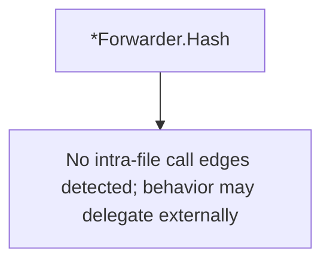

# Behavior Atom: config/model.go

## Source Anchor

- Go source: [cloudflare/cloudflared@2026.3.0/config/model.go](https://github.com/cloudflare/cloudflared/blob/2026.3.0/config/model.go)
- Package: config
- Module group: config

## Behavioral Responsibility

Configuration, identity, and credential handling behavior.

## Entry Points

- (*Forwarder) Hash() string (line 36)

## Internal Function Surface

- None detected.

## Input Contract

- Inputs are indirect through callers; no direct input pattern detected statically.

## Output Contract

- return:string

## Side Effects and State Transitions

- network I/O

## Branching and Failure Semantics

- Branch density: if=0, switch=0, select=0
- No explicit failure pattern markers found in static scan.

## Import and Dependency Surface

- crypto/sha256
- fmt
- io

## Go-Impl Flow (Intra-file)

## Rust Porting Notes

- **Data model with hash**: `crypto/sha256.Sum256()` on serialized config → `sha2::Sha256::digest()` from `sha2` crate.
- **Quirk — zero branching**: Pure data types; direct `#[derive(Serialize, Deserialize)]` translation.

## Accuracy Notes

- Generated from Go AST parsing and source text pattern extraction.
- Source link is authoritative for disputed semantics; keep this atom synchronized with the linked file.
