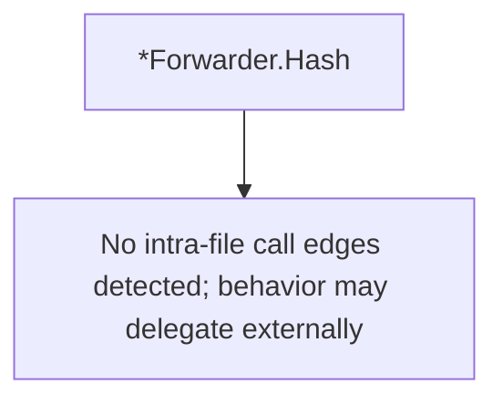

# Behavior Atom: config/model.go

## Source Anchor

- Go source: [cloudflare/cloudflared@2026.3.0/config/model.go](https://github.com/cloudflare/cloudflared/blob/2026.3.0/config/model.go)
- Package: config
- Module group: config

## Behavioral Responsibility

Configuration, identity, and credential handling behavior.

## Struct Definitions

### Forwarder

Client-side listener configuration for forwarding traffic to the edge.
Used by `cmd/cloudflared/access/carrier.go` (`StartForwarder`) and
`cmd/cloudflared/app_forward_service.go` (`NewForwardService`).

| Field | Type | JSON tag | YAML tag | Purpose |
| --- | --- | --- | --- | --- |
| URL | string | `url` | — | Origin URL of the Access application on the edge |
| Listener | string | `listener` | — | Local `host:port` address to bind the forwarding listener |
| TokenClientID | string | `service_token_id` | `serviceTokenID` | Access service-token client ID for headless auth |
| TokenSecret | string | `secret_token_id` | `serviceTokenSecret` | Access service-token secret for headless auth |
| Destination | string | `destination` | — | Bastion-mode jump destination header value |
| IsFedramp | bool | `is_fedramp` | `isFedramp` | Routes token flow through FedRAMP-compliant endpoint |

### Tunnel

Tunnel-start configuration for a single tunnel entry.

| Field | Type | JSON tag | YAML tag | Purpose |
| --- | --- | --- | --- | --- |
| URL | string | `url` | — | Local origin URL to proxy |
| Origin | string | `origin` | — | Alternate origin specifier |
| ProtocolType | string | `type` | — | Protocol selection hint |

### Root

Top-level service configuration; contains global settings and
collections of `Forwarder` and `Tunnel` entries.

| Field | Type | JSON tag | YAML tag | Purpose |
| --- | --- | --- | --- | --- |
| LogDirectory | string | `log_directory` | `logDirectory,omitempty` | Directory path for log files |
| LogLevel | string | `log_level` | `logLevel,omitempty` | Logging verbosity level |
| Forwarders | []Forwarder | `forwarders,omitempty` | `forwarders,omitempty` | List of access-forwarder configs |
| Tunnels | []Tunnel | `tunnels,omitempty` | `tunnels,omitempty` | List of tunnel-start configs |

Note: the `resolver` key is reserved for a removed feature (proxy-dns)
and should not be used.

## Entry Points

- (*Forwarder) Hash() string (line 36)

## Internal Function Surface

- None detected.

## Input Contract

- Inputs are indirect through callers; no direct input pattern detected statically.

## Output Contract

- return:string

## Side Effects and State Transitions

- network I/O

## Branching and Failure Semantics

- Branch density: if=0, switch=0, select=0
- No explicit failure pattern markers found in static scan.

## Import and Dependency Surface

- crypto/sha256
- fmt
- io

## Go-Impl Flow (Intra-file)

```mermaid
flowchart TD
    F1["*Forwarder.Hash"]
    NOTE["No intra-file call edges detected; behavior may delegate externally"]
    F1 --> NOTE
```

## Rust Porting Notes

- **Data model with hash**: `crypto/sha256.Sum256()` on serialized config → `sha2::Sha256::digest()` from `sha2` crate.
- **Quirk — zero branching**: Pure data types; direct `#[derive(Serialize, Deserialize)]` translation.

## Accuracy Notes

- Generated from Go AST parsing and source text pattern extraction.
- Source link is authoritative for disputed semantics; keep this atom synchronized with the linked file.
