# Behavior Atom: connection/connection.go

## Source Anchor

- Go source: [cloudflare/cloudflared@2026.3.0/connection/connection.go](https://github.com/cloudflare/cloudflared/blob/2026.3.0/connection/connection.go)
- Package: connection
- Module group: connection

## Behavioral Responsibility

Transport/protocol behavior for edge-origin data and control flows.

## Entry Points

- (*Credentials) Auth() pogs.TunnelAuth (line 71)
- (TunnelToken) Credentials() Credentials (line 86)
- (TunnelToken) Encode() (string, error) (line 96)
- (Type) String() string (line 133)
- NewHTTPResponseReadWriterAcker(w ResponseWriter, flusher http.Flusher, req *http.Request)*HTTPResponseReadWriteAcker (line 180)
- (*HTTPResponseReadWriteAcker) Read(p []byte) (int, error) (line 189)
- (*HTTPResponseReadWriteAcker) Write(p []byte) (int, error) (line 193)
- (*HTTPResponseReadWriteAcker) AckConnection(tracePropagation string) error (line 203)
- (*localProxyConnection) Read(b []byte) (int, error) (line 228)
- (*localProxyConnection) Write(b []byte) (int, error) (line 232)
- (*localProxyConnection) Close() error (line 236)
- (*localProxyConnection) LocalAddr() net.Addr (line 240)
- (*localProxyConnection) RemoteAddr() net.Addr (line 245)
- (*localProxyConnection) SetDeadline(t time.Time) error (line 250)
- (*localProxyConnection) SetReadDeadline(t time.Time) error (line 255)
- (*localProxyConnection) SetWriteDeadline(t time.Time) error (line 260)
- FindCfRayHeader(req *http.Request) string (line 313)
- IsLBProbeRequest(req *http.Request) bool (line 317)

## Internal Function Surface

- (Type) shouldFlush() bool (line 124)
- shouldFlush(headers http.Header) bool (line 281)
- uint8ToString(input uint8) string (line 309)

## Input Contract

- HTTP requests
- func-param:b []byte
- func-param:flusher http.Flusher
- func-param:headers http.Header
- func-param:input uint8
- func-param:p []byte
- func-param:req *http.Request
- func-param:t time.Time
- func-param:tracePropagation string
- func-param:w ResponseWriter

## Output Contract

- HTTP response writes
- return:*HTTPResponseReadWriteAcker
- return:Credentials
- return:bool
- return:error
- return:int
- return:net.Addr
- return:pogs.TunnelAuth
- return:string

## Side Effects and State Transitions

- network I/O

## Branching and Failure Semantics

- Branch density: if=9, switch=2, select=0
- error-return paths
- fallback/default branches

## Import and Dependency Surface

- context
- encoding/base64
- fmt
- github.com/cloudflare/cloudflared/tracing
- github.com/cloudflare/cloudflared/tunnelrpc/pogs
- github.com/cloudflare/cloudflared/websocket
- github.com/google/uuid
- github.com/pkg/errors
- io
- math
- net
- net/http
- strconv
- strings
- time

## Go-Impl Flow (Intra-file)

```mermaid
flowchart TD
    F1["*Credentials.Auth"]
    F2["TunnelToken.Credentials"]
    F3["TunnelToken.Encode"]
    F4["Type.shouldFlush"]
    F5["Type.String"]
    F6["NewHTTPResponseReadWriterAcker"]
    F7["*HTTPResponseReadWriteAcker.Read"]
    F8["*HTTPResponseReadWriteAcker.Write"]
    F9["*HTTPResponseReadWriteAcker.AckConnection"]
    F10["*localProxyConnection.Read"]
    F11["*localProxyConnection.Write"]
    F12["*localProxyConnection.Close"]
    F13["*localProxyConnection.LocalAddr"]
    F14["*localProxyConnection.RemoteAddr"]
    F15["*localProxyConnection.SetDeadline"]
    F16["*localProxyConnection.SetReadDeadline"]
    F17["*localProxyConnection.SetWriteDeadline"]
    F18["shouldFlush"]
    F19["uint8ToString"]
    F20["FindCfRayHeader"]
    F21["IsLBProbeRequest"]
    NOTE["No intra-file call edges detected; behavior may delegate externally"]
    F1 --> NOTE
```

## Rust Porting Notes

- **Implicit net.Conn**: `localProxyConnection` satisfies `net.Conn` implicitly → in Rust, implement `tokio::io::AsyncRead + AsyncWrite` explicitly on the proxy connection struct, plus custom `LocalAddr`/`RemoteAddr` accessors.
- **HTTP flusher pattern**: `HTTPResponseReadWriteAcker` wraps `http.Flusher` + `ResponseWriter` → use `hyper::body::Sender` or an equivalent streaming body type; Rust HTTP frameworks expose flushing differently than Go's explicit `Flusher` interface.
- **Credential encoding**: `TunnelToken.Encode()` uses `base64.StdEncoding` → `base64::engine::general_purpose::STANDARD` from the `base64` crate.
- **Connection type enum**: `Type` with `shouldFlush()` method and `String()` → Rust `enum ConnectionType` with `#[derive(Display)]` from `strum` or manual `Display` impl; flush decision becomes a `match` arm.
- **Header utilities**: `FindCfRayHeader()` and `IsLBProbeRequest()` do HTTP header lookups → free functions taking `&http::HeaderMap` references.
- **Quirk — dual shouldFlush**: Both a method receiver `(Type).shouldFlush()` and standalone `shouldFlush(headers)` function exist — in Rust, unify into a single function or use a trait method to avoid name collision.

## Accuracy Notes

- Generated from Go AST parsing and source text pattern extraction.
- Source link is authoritative for disputed semantics; keep this atom synchronized with the linked file.
