# Behavior Atom: connection/control.go

## Source Anchor

- Go source: [cloudflare/cloudflared@2026.3.0/connection/control.go](https://github.com/cloudflare/cloudflared/blob/2026.3.0/connection/control.go)
- Package: connection
- Module group: connection

## Behavioral Responsibility

Transport/protocol behavior for edge-origin data and control flows.

## Entry Points

- NewControlStream(observer *Observer, connectedFuse ConnectedFuse, tunnelProperties*TunnelProperties, connIndex uint8, edgeAddress net.IP, registerClientFunc registerClientFunc, registerTimeout time.Duration, gracefulShutdownC <-chan struct{}, gracePeriod time.Duration, protocol Protocol) ControlStreamHandler (line 49)
- (*controlStream) ServeControlStream(ctx context.Context, rw io.ReadWriteCloser, connOptions*pogs.ConnectionOptions, tunnelConfigGetter TunnelConfigJSONGetter) error (line 78)
- (*controlStream) IsStopped() bool (line 149)

## Internal Function Surface

- (*controlStream) waitForUnregister(ctx context.Context, registrationClient tunnelrpc.RegistrationClient) error (line 124)

## Input Contract

- func-param:connIndex uint8
- func-param:connOptions *pogs.ConnectionOptions
- func-param:connectedFuse ConnectedFuse
- func-param:ctx context.Context
- func-param:edgeAddress net.IP
- func-param:gracePeriod time.Duration
- func-param:gracefulShutdownC <-chan struct{}
- func-param:observer *Observer
- func-param:protocol Protocol
- func-param:registerClientFunc registerClientFunc
- func-param:registerTimeout time.Duration
- func-param:registrationClient tunnelrpc.RegistrationClient
- func-param:rw io.ReadWriteCloser
- func-param:tunnelConfigGetter TunnelConfigJSONGetter
- func-param:tunnelProperties *TunnelProperties

## Output Contract

- metrics emission
- return:ControlStreamHandler
- return:bool
- return:error
- stdout/stderr or structured logs

## Side Effects and State Transitions

- network I/O

## Branching and Failure Semantics

- Branch density: if=7, switch=0, select=1
- error-return paths

## Import and Dependency Surface

- context
- github.com/cloudflare/cloudflared/management
- github.com/cloudflare/cloudflared/tunnelrpc
- github.com/cloudflare/cloudflared/tunnelrpc/pogs
- github.com/pkg/errors
- io
- net
- time

## Go-Impl Flow (Intra-file)

```mermaid
flowchart TD
    F1["NewControlStream"]
    F2["*controlStream.ServeControlStream"]
    F3["*controlStream.waitForUnregister"]
    F4["*controlStream.IsStopped"]
    NOTE["No intra-file call edges detected; behavior may delegate externally"]
    F1 --> NOTE
```

## Accuracy Notes

- Generated from Go AST parsing and source text pattern extraction.
- Source link is authoritative for disputed semantics; keep this atom synchronized with the linked file.

## Rust Porting Notes

- **Stream abstraction**: `io.ReadWriteCloser` → `tokio::io::AsyncRead + AsyncWrite + Unpin` or a boxed `AsyncReadWrite` trait object.
- **Connected fuse**: `ConnectedFuse` one-shot notification → `tokio::sync::Notify` (single waiter) or `Arc<AtomicBool>` with `Notify` wakeup.
- **Shutdown signal**: `<-chan struct{}` graceful-shutdown channel → `tokio_util::sync::CancellationToken`.
- **Select on context + shutdown**: The single `select` statement → `tokio::select!` with cancellation token and context-derived future.
- **RPC client**: `tunnelrpc.RegistrationClient` Cap'n Proto client → generated Rust Cap'n Proto client via `capnpc-rust`, or a manually implemented trait.
- **Callback injection**: `registerClientFunc` function-typed field → `Box<dyn Fn(...) -> ... + Send + Sync>` or async trait method.
- **Grace period**: Timeout-guarded unregistration → `tokio::time::timeout(duration, future)`.
- **Quirk — no intra-file call edges**: All behavior delegates to external RPC and connection types; the Rust port should use trait bounds to keep this file testable with mocks.
