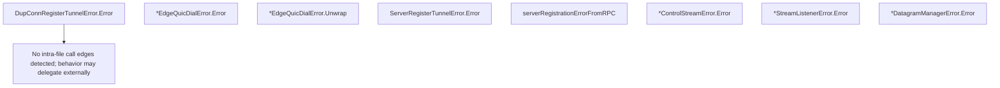

# Behavior Atom: connection/errors.go

## Source Anchor

- Go source: [cloudflare/cloudflared@2026.3.0/connection/errors.go](https://github.com/cloudflare/cloudflared/blob/2026.3.0/connection/errors.go)
- Package: connection
- Module group: connection

## Behavioral Responsibility

Transport/protocol behavior for edge-origin data and control flows.

## Entry Points

- (DupConnRegisterTunnelError) Error() string (line 15)
- (*EdgeQuicDialError) Error() string (line 24)
- (*EdgeQuicDialError) Unwrap() error (line 28)
- (ServerRegisterTunnelError) Error() string (line 38)
- (*ControlStreamError) Error() string (line 59)
- (*StreamListenerError) Error() string (line 67)
- (*DatagramManagerError) Error() string (line 75)

## Internal Function Surface

- serverRegistrationErrorFromRPC(err error) ServerRegisterTunnelError (line 42)

## Input Contract

- func-param:err error

## Output Contract

- return:ServerRegisterTunnelError
- return:error
- return:string

## Side Effects and State Transitions

- network I/O

## Branching and Failure Semantics

- Branch density: if=1, switch=0, select=0
- error-return paths

## Import and Dependency Surface

- github.com/cloudflare/cloudflared/tunnelrpc/pogs

## Go-Impl Flow (Intra-file)

## Accuracy Notes

- Generated from Go AST parsing and source text pattern extraction.
- Source link is authoritative for disputed semantics; keep this atom synchronized with the linked file.

## Rust Porting Notes

- **Error taxonomy**: Seven Go error types → single `#[derive(thiserror::Error)]` enum `ConnectionError` with variants for each category (`DupConnRegister`, `EdgeQuicDial`, `ServerRegisterTunnel`, `ControlStream`, `StreamListener`, `DatagramManager`).
- **Unwrap chain**: `EdgeQuicDialError.Unwrap()` → `#[source]` attribute on the enum variant for automatic `Error::source()` implementation.
- **Error matching**: Callers use `errors.Is`/`errors.As` → `match` on enum variants or `downcast_ref` if using `anyhow`.
- **Minimal complexity**: Only 1 if-branch; the Rust port should remain a pure type-definition file with no logic beyond `Display`/`Error` impls.
- **Quirk — string-only errors**: `DupConnRegisterTunnelError` is a string-typed error — in Rust, use a variant with a message field rather than a bare `String` to preserve type safety.
