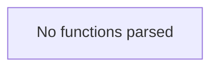

# Behavior Atom: connection/event.go

## Source Anchor

- Go source: [cloudflare/cloudflared@2026.3.0/connection/event.go](https://github.com/cloudflare/cloudflared/blob/2026.3.0/connection/event.go)
- Package: connection
- Module group: connection

## Behavioral Responsibility

Transport/protocol behavior for edge-origin data and control flows.

## Entry Points

- No exported/main/init entry point detected; behavior is internal support logic.

## Internal Function Surface

- None detected.

## Input Contract

- Inputs are indirect through callers; no direct input pattern detected statically.

## Output Contract

- Output is primarily side-effect based; no explicit return/output pattern detected statically.

## Side Effects and State Transitions

- network I/O

## Branching and Failure Semantics

- Branch density: if=0, switch=0, select=0
- No explicit failure pattern markers found in static scan.

## Import and Dependency Surface

- net

## Go-Impl Flow (Intra-file)

## Rust Porting Notes

- **Event type definitions**: File defines connection event types/constants with no functions → translate as a Rust `enum` (possibly `#[derive(Clone, Debug)]`) with variant data, placed in a `connection::event` submodule.
- **Network address dependency**: Imports `net` for address types → use `std::net::SocketAddr` or `std::net::IpAddr` as appropriate.
- **Quirk — no logic**: Pure type/constant file; the Rust port should remain a zero-logic type definition module.

## Accuracy Notes

- Generated from Go AST parsing and source text pattern extraction.
- Source link is authoritative for disputed semantics; keep this atom synchronized with the linked file.
