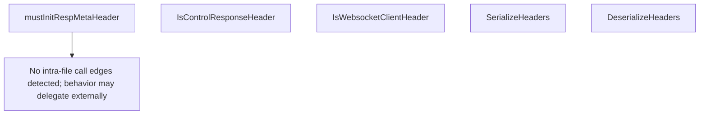

# Behavior Atom: connection/header.go

## Source Anchor

- Go source: [cloudflare/cloudflared@2026.3.0/connection/header.go](https://github.com/cloudflare/cloudflared/blob/2026.3.0/connection/header.go)
- Package: connection
- Module group: connection

## Behavioral Responsibility

Transport/protocol behavior for edge-origin data and control flows.

## Entry Points

- IsControlResponseHeader(headerName string) bool (line 53)
- IsWebsocketClientHeader(headerName string) bool (line 61)
- SerializeHeaders(h1Headers http.Header) string (line 69)
- DeserializeHeaders(serializedHeaders string) ([]HTTPHeader, error) (line 115)

## Internal Function Surface

- mustInitRespMetaHeader(src string, flowRateLimited bool) string (line 42)

## Input Contract

- func-param:flowRateLimited bool
- func-param:h1Headers http.Header
- func-param:headerName string
- func-param:serializedHeaders string
- func-param:src string

## Output Contract

- HTTP response writes
- return:[]HTTPHeader
- return:bool
- return:error
- return:string

## Side Effects and State Transitions

- network I/O

## Branching and Failure Semantics

- Branch density: if=9, switch=0, select=0
- error-return paths
- panic paths

## Import and Dependency Surface

- encoding/base64
- fmt
- github.com/pkg/errors
- net/http
- strings

## Go-Impl Flow (Intra-file)

## Accuracy Notes

- Generated from Go AST parsing and source text pattern extraction.
- Source link is authoritative for disputed semantics; keep this atom synchronized with the linked file.

## Rust Porting Notes

- **Header serialization**: `SerializeHeaders` encodes HTTP headers as base64 key-value pairs → implement with `base64::engine::general_purpose::STANDARD.encode` and join with delimiter. Wire format must match Go exactly for edge compatibility.
- **Header deserialization**: `DeserializeHeaders` splits and base64-decodes → `base64::engine::general_purpose::STANDARD.decode` with error mapping.
- **Control response detection**: `IsControlResponseHeader` string prefix check → `str::starts_with` on `http::HeaderName` string representation.
- **WebSocket header detection**: `IsWebsocketClientHeader` string matching → compare against constant header names; use `http::header::HeaderName` for type-safe comparison.
- **Quirk — base64 wire format**: The serialized header format is a custom wire protocol shared with the edge — the Rust implementation must produce byte-identical output to maintain protocol compatibility.
