# Behavior Atom: connection/http2.go

## Source Anchor

- Go source: [cloudflare/cloudflared@2026.3.0/connection/http2.go](https://github.com/cloudflare/cloudflared/blob/2026.3.0/connection/http2.go)
- Package: connection
- Module group: connection

## Behavioral Responsibility

Transport/protocol behavior for edge-origin data and control flows.

## Entry Points

- NewHTTP2Connection(conn net.Conn, orchestrator Orchestrator, connOptions *client.ConnectionOptionsSnapshot, observer*Observer, connIndex uint8, controlStreamHandler ControlStreamHandler, log *zerolog.Logger)*HTTP2Connection (line 54)
- (*HTTP2Connection) Serve(ctx context.Context) error (line 78)
- (*HTTP2Connection) ServeHTTP(w http.ResponseWriter, r*http.Request) (line 99)
- NewHTTP2RespWriter(r *http.Request, w http.ResponseWriter, connType Type, log*zerolog.Logger) (*http2RespWriter, error) (line 206)
- (*http2RespWriter) AddTrailer(trailerName string, trailerValue string) (line 229)
- (*http2RespWriter) WriteRespHeaders(status int, header http.Header) error (line 238)
- (*http2RespWriter) Header() http.Header (line 288)
- (*http2RespWriter) Flush() (line 292)
- (*http2RespWriter) WriteHeader(status int) (line 296)
- (*http2RespWriter) Hijack() (net.Conn,*bufio.ReadWriter, error) (line 310)
- (*http2RespWriter) WriteErrorResponse(err error) bool (line 334)
- (*http2RespWriter) Read(p []byte) (n int, err error) (line 354)
- (*http2RespWriter) Write(p []byte) (n int, err error) (line 358)
- (*http2RespWriter) Close() error (line 373)
- IsTCPStream(r *http.Request) bool (line 418)

## Internal Function Surface

- (*HTTP2Connection) handleConfigurationUpdate(respWriter*http2RespWriter, r *http.Request) error (line 174)
- (*HTTP2Connection) close() (line 188)
- (*http2RespWriter) hijacked() bool (line 304)
- (*http2RespWriter) setResponseMetaHeader(value string) (line 350)
- determineHTTP2Type(r *http.Request) Type (line 377)
- handleMissingRequestParts(connType Type, r *http.Request) (line 392)
- isControlStreamUpgrade(r *http.Request) bool (line 405)
- isWebsocketUpgrade(r *http.Request) bool (line 409)
- isConfigurationUpdate(r *http.Request) bool (line 413)
- stripWebsocketUpgradeHeader(r *http.Request) (line 422)
- getRequestHost(r *http.Request) (string, error) (line 427)

## Input Contract

- HTTP requests
- func-param:conn net.Conn
- func-param:connIndex uint8
- func-param:connOptions *client.ConnectionOptionsSnapshot
- func-param:connType Type
- func-param:controlStreamHandler ControlStreamHandler
- func-param:ctx context.Context
- func-param:err error
- func-param:header http.Header
- func-param:log *zerolog.Logger
- func-param:observer *Observer
- func-param:orchestrator Orchestrator
- func-param:p []byte
- func-param:r *http.Request
- func-param:respWriter *http2RespWriter
- func-param:status int
- func-param:trailerName string
- func-param:trailerValue string
- func-param:value string
- func-param:w http.ResponseWriter

## Output Contract

- HTTP response writes
- return:*HTTP2Connection
- return:*bufio.ReadWriter
- return:*http2RespWriter
- return:Type
- return:bool
- return:err error
- return:error
- return:http.Header
- return:n int
- return:net.Conn
- return:string
- stdout/stderr or structured logs

## Side Effects and State Transitions

- network I/O
- concurrency primitives

## Branching and Failure Semantics

- Branch density: if=31, switch=3, select=0
- error-return paths
- panic paths
- fallback/default branches

## Import and Dependency Surface

- bufio
- context
- encoding/json
- fmt
- github.com/cloudflare/cloudflared/client
- github.com/cloudflare/cloudflared/flow
- github.com/cloudflare/cloudflared/tracing
- github.com/pkg/errors
- github.com/rs/zerolog
- golang.org/x/net/http2
- io
- net
- net/http
- runtime/debug
- strings
- sync

## Go-Impl Flow (Intra-file)

```mermaid
flowchart TD
    F1["NewHTTP2Connection"]
    F2["*HTTP2Connection.Serve"]
    F3["*HTTP2Connection.ServeHTTP"]
    F4["*HTTP2Connection.handleConfigurationUpdate"]
    F5["*HTTP2Connection.close"]
    F6["NewHTTP2RespWriter"]
    F7["*http2RespWriter.AddTrailer"]
    F8["*http2RespWriter.WriteRespHeaders"]
    F9["*http2RespWriter.Header"]
    F10["*http2RespWriter.Flush"]
    F11["*http2RespWriter.WriteHeader"]
    F12["*http2RespWriter.hijacked"]
    F13["*http2RespWriter.Hijack"]
    F14["*http2RespWriter.WriteErrorResponse"]
    F15["*http2RespWriter.setResponseMetaHeader"]
    F16["*http2RespWriter.Read"]
    F17["*http2RespWriter.Write"]
    F18["*http2RespWriter.Close"]
    F19["determineHTTP2Type"]
    F20["handleMissingRequestParts"]
    F21["isControlStreamUpgrade"]
    F22["isWebsocketUpgrade"]
    F23["isConfigurationUpdate"]
    F24["IsTCPStream"]
    F25["stripWebsocketUpgradeHeader"]
    F26["getRequestHost"]
    F3 --> F19
    F3 --> F20
    F3 --> F6
    F3 --> F25
    F3 --> F26
    F19 --> F23
    F19 --> F22
    F19 --> F24
    F19 --> F21
```

## Accuracy Notes

- Generated from Go AST parsing and source text pattern extraction.
- Source link is authoritative for disputed semantics; keep this atom synchronized with the linked file.

## Rust Porting Notes

- **HTTP/2 server**: `http.Server` with `http2` transport → `hyper::server::conn::http2::Builder` serving over a TLS `net::TcpStream`.
- **Response writer**: `http2RespWriter` implementing `http.ResponseWriter` + `http.Hijacker` → custom struct wrapping `hyper::body::Sender` with header/trailer support.
- **Hijack support**: Go's `Hijacker` interface returns raw `net.Conn` → Rust needs `hyper::upgrade::on()` to extract the underlying stream for WebSocket/TCP passthrough.
- **Control stream**: Configuration update stream multiplexed over HTTP/2 → dedicated `h2` stream or a management endpoint on the same connection.
- **Panic recovery**: `runtime/debug.Stack()` on panics → `std::panic::catch_unwind` with `backtrace::Backtrace`; Rust panics in async tasks abort the task but don't propagate.
- **Flow tracking**: `flow.Track` integration → `tracing::instrument` for per-request instrumentation.
- **Quirk — 31 if-branches**: Dense conditional logic in `ServeHTTP` handling WebSocket upgrades, TCP streams, and config updates — decompose into separate handler methods dispatched by request type.
- **Quirk — JSON encoding for errors**: Error responses serialized to JSON via `encoding/json` → `serde_json::to_vec` with a typed error response struct.
