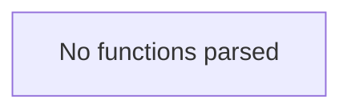

# Behavior Atom: connection/json.go

## Source Anchor

- Go source: [cloudflare/cloudflared@2026.3.0/connection/json.go](https://github.com/cloudflare/cloudflared/blob/2026.3.0/connection/json.go)
- Package: connection
- Module group: connection

## Behavioral Responsibility

Transport/protocol behavior for edge-origin data and control flows.

## Entry Points

- No exported/main/init entry point detected; behavior is internal support logic.

## Internal Function Surface

- None detected.

## Input Contract

- Inputs are indirect through callers; no direct input pattern detected statically.

## Output Contract

- Output is primarily side-effect based; no explicit return/output pattern detected statically.

## Side Effects and State Transitions

- No high-signal side effect pattern detected in static scan.

## Branching and Failure Semantics

- Branch density: if=0, switch=0, select=0
- No explicit failure pattern markers found in static scan.

## Import and Dependency Surface

- github.com/json-iterator/go

## Go-Impl Flow (Intra-file)

## Rust Porting Notes

- **JSON library**: Uses `github.com/json-iterator/go` (jsoniter) for performance-optimized JSON → in Rust, `serde_json` is the standard choice; if performance is critical, `simd-json` is the equivalent high-performance alternative.
- **Package-level variable**: Likely declares a package-level `json` variable configured for compatible mode → in Rust, no global config needed; `serde_json` is configured per-call or via `#[serde(...)]` attributes on types.
- **Quirk — no functions**: The file only configures a JSON codec instance; the Rust port eliminates this file entirely since `serde` + `serde_json` handle serialization via derive macros on each type.

## Accuracy Notes

- Generated from Go AST parsing and source text pattern extraction.
- Source link is authoritative for disputed semantics; keep this atom synchronized with the linked file.
