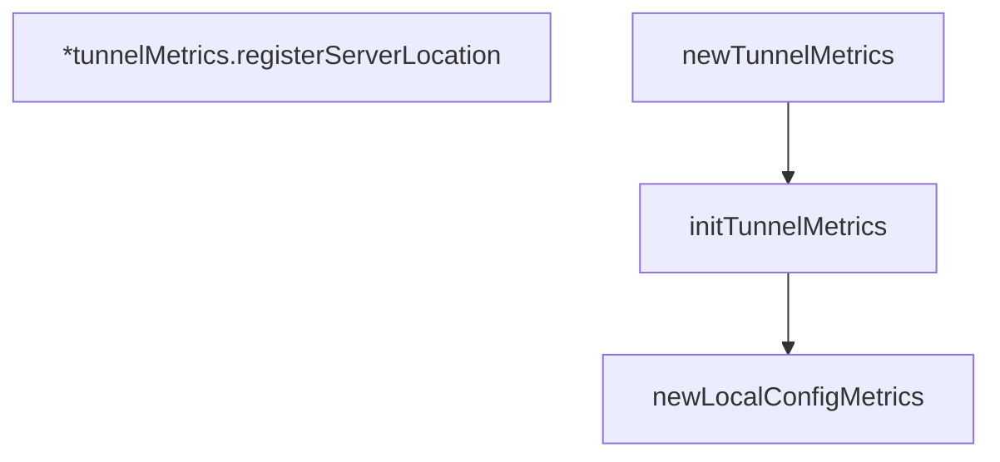

# Behavior Atom: connection/metrics.go

## Source Anchor

- Go source: [cloudflare/cloudflared@2026.3.0/connection/metrics.go](https://github.com/cloudflare/cloudflared/blob/2026.3.0/connection/metrics.go)
- Package: connection
- Module group: connection

## Behavioral Responsibility

Transport/protocol behavior for edge-origin data and control flows.

## Entry Points

- No exported/main/init entry point detected; behavior is internal support logic.

## Internal Function Surface

- newLocalConfigMetrics() *localConfigMetrics (line 38)
- initTunnelMetrics() *tunnelMetrics (line 70)
- (*tunnelMetrics) registerServerLocation(connectionID string, loc string) (line 149)
- newTunnelMetrics() *tunnelMetrics (line 166)

## Input Contract

- func-param:connectionID string
- func-param:loc string

## Output Contract

- metrics emission
- return:*localConfigMetrics
- return:*tunnelMetrics

## Side Effects and State Transitions

- network I/O
- concurrency primitives

## Branching and Failure Semantics

- Branch density: if=2, switch=0, select=0
- No explicit failure pattern markers found in static scan.

## Import and Dependency Surface

- github.com/prometheus/client_golang/prometheus
- sync

## Go-Impl Flow (Intra-file)

## Rust Porting Notes

- **Prometheus metrics**: `prometheus/client_golang` counters/gauges → `prometheus` crate (`IntCounter`, `IntGauge`, `HistogramVec`, etc.) with `lazy_static!` or `once_cell::sync::Lazy` for registration.
- **Factory chain**: `newTunnelMetrics()` → `initTunnelMetrics()` → `newLocalConfigMetrics()` calls form an init chain → in Rust, use a single `TunnelMetrics::new()` constructor that initializes all sub-metrics, registered via `prometheus::default_registry()`.
- **Mutex-protected state**: `sync.Mutex` guards `tunnelMetrics` fields → `std::sync::Mutex<T>` or `parking_lot::Mutex<T>`; consider `Arc<Mutex<T>>` if shared across tasks.
- **Server location tracking**: `registerServerLocation(connectionID, loc)` mutates metrics state → idiomatic Rust: method on `&self` with interior mutability via `Mutex` or atomic label updates.
- **Quirk — init() pattern**: If Go uses `init()` for metric registration, translate to `once_cell::sync::Lazy<TunnelMetrics>` or explicit initialization in the application startup path.

## Accuracy Notes

- Generated from Go AST parsing and source text pattern extraction.
- Source link is authoritative for disputed semantics; keep this atom synchronized with the linked file.
