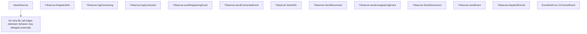

# Behavior Atom: connection/observer.go

## Source Anchor

- Go source: [cloudflare/cloudflared@2026.3.0/connection/observer.go](https://github.com/cloudflare/cloudflared/blob/2026.3.0/connection/observer.go)
- Package: connection
- Module group: connection

## Behavioral Responsibility

Transport/protocol behavior for edge-origin data and control flows.

## Entry Points

- NewObserver(log *zerolog.Logger, logTransport*zerolog.Logger) *Observer (line 33)
- (*Observer) RegisterSink(sink EventSink) (line 45)
- (*Observer) SendURL(url string) (line 78)
- (*Observer) SendReconnect(connIndex uint8) (line 89)
- (*Observer) SendDisconnect(connIndex uint8) (line 97)
- (EventSinkFunc) OnTunnelEvent(event Event) (line 126)

## Internal Function Surface

- (*Observer) logConnecting(connIndex uint8, address net.IP, protocol Protocol) (line 49)
- (*Observer) logConnected(connectionID uuid.UUID, connIndex uint8, location string, address net.IP, protocol Protocol) (line 58)
- (*Observer) sendRegisteringEvent(connIndex uint8) (line 70)
- (*Observer) sendConnectedEvent(connIndex uint8, protocol Protocol, location string, edgeAddress net.IP) (line 74)
- (*Observer) sendUnregisteringEvent(connIndex uint8) (line 93)
- (*Observer) sendEvent(e Event) (line 101)
- (*Observer) dispatchEvents() (line 110)

## Input Contract

- func-param:address net.IP
- func-param:connIndex uint8
- func-param:connectionID uuid.UUID
- func-param:e Event
- func-param:edgeAddress net.IP
- func-param:event Event
- func-param:location string
- func-param:log *zerolog.Logger
- func-param:logTransport *zerolog.Logger
- func-param:protocol Protocol
- func-param:sink EventSink
- func-param:url string

## Output Contract

- metrics emission
- return:*Observer
- stdout/stderr or structured logs

## Side Effects and State Transitions

- network I/O

## Branching and Failure Semantics

- Branch density: if=1, switch=0, select=2
- fallback/default branches

## Import and Dependency Surface

- github.com/cloudflare/cloudflared/management
- github.com/google/uuid
- github.com/rs/zerolog
- net
- strings

## Go-Impl Flow (Intra-file)

## Accuracy Notes

- Generated from Go AST parsing and source text pattern extraction.
- Source link is authoritative for disputed semantics; keep this atom synchronized with the linked file.

## Rust Porting Notes

- **Observer pattern**: `EventSink` slice with `RegisterSink` → `Vec<Box<dyn EventSink + Send + Sync>>` or `tokio::sync::broadcast::Sender<Event>` for fan-out.
- **EventSinkFunc adapter**: Go function-type implementing interface → Rust closure wrapped in a newtype implementing the `EventSink` trait, or use `impl Fn(Event)` directly.
- **Select on URL send**: `select` with default for non-blocking send → `tokio::sync::mpsc::Sender::try_send()` for non-blocking event dispatch.
- **Management event bridge**: Observer sends events to `management.EventSink` → ensure the management event channel is typed as `mpsc::Sender<ManagementEvent>`.
- **Minimal branching**: Only 1 if-statement; the observer is a thin dispatch layer that should remain thin in Rust.
