# Behavior Atom: connection/protocol.go

## Source Anchor

- Go source: [cloudflare/cloudflared@2026.3.0/connection/protocol.go](https://github.com/cloudflare/cloudflared/blob/2026.3.0/connection/protocol.go)
- Package: connection
- Module group: connection

## Behavioral Responsibility

Transport/protocol behavior for edge-origin data and control flows.

## Entry Points

- (Protocol) String() string (line 52)
- (Protocol) TLSSettings() *TLSSettings (line 63)
- (*staticProtocolSelector) Current() Protocol (line 94)
- (*staticProtocolSelector) Fallback() (Protocol, bool) (line 98)
- (*remoteProtocolSelector) Current() Protocol (line 137)
- (*remoteProtocolSelector) Fallback() (Protocol, bool) (line 155)
- (*defaultProtocolSelector) Current() Protocol (line 191)
- (*defaultProtocolSelector) Fallback() (Protocol, bool) (line 197)
- NewProtocolSelector(protocolFlag string, accountTag string, tunnelTokenProvided bool, needPQ bool, protocolFetcher edgediscovery.PercentageFetcher, resolveTTL time.Duration, log *zerolog.Logger) (ProtocolSelector, error) (line 203)

## Internal Function Surface

- (Protocol) fallback() (Protocol, bool) (line 41)
- newRemoteProtocolSelector(current Protocol, protocolPool []Protocol, switchThreshold int32, fetchFunc edgediscovery.PercentageFetcher, ttl time.Duration, log *zerolog.Logger)*remoteProtocolSelector (line 118)
- getProtocol(protocolPool []Protocol, fetchFunc edgediscovery.PercentageFetcher, switchThreshold int32) (Protocol, error) (line 161)
- newDefaultProtocolSelector(current Protocol) *defaultProtocolSelector (line 183)
- switchThreshold(accountTag string) int32 (line 250)

## Input Contract

- func-param:accountTag string
- func-param:current Protocol
- func-param:fetchFunc edgediscovery.PercentageFetcher
- func-param:log *zerolog.Logger
- func-param:needPQ bool
- func-param:protocolFetcher edgediscovery.PercentageFetcher
- func-param:protocolFlag string
- func-param:protocolPool []Protocol
- func-param:resolveTTL time.Duration
- func-param:switchThreshold int32
- func-param:ttl time.Duration
- func-param:tunnelTokenProvided bool

## Output Contract

- HTTP response writes
- return:*TLSSettings
- return:*defaultProtocolSelector
- return:*remoteProtocolSelector
- return:Protocol
- return:ProtocolSelector
- return:bool
- return:error
- return:int32
- return:string
- stdout/stderr or structured logs

## Side Effects and State Transitions

- network I/O
- concurrency primitives

## Branching and Failure Semantics

- Branch density: if=7, switch=4, select=0
- error-return paths
- fallback/default branches

## Import and Dependency Surface

- fmt
- github.com/cloudflare/cloudflared/edgediscovery
- github.com/rs/zerolog
- hash/fnv
- sync
- time

## Go-Impl Flow (Intra-file)

```mermaid
flowchart TD
    F1["Protocol.fallback"]
    F2["Protocol.String"]
    F3["Protocol.TLSSettings"]
    F4["*staticProtocolSelector.Current"]
    F5["*staticProtocolSelector.Fallback"]
    F6["newRemoteProtocolSelector"]
    F7["*remoteProtocolSelector.Current"]
    F8["*remoteProtocolSelector.Fallback"]
    F9["getProtocol"]
    F10["newDefaultProtocolSelector"]
    F11["*defaultProtocolSelector.Current"]
    F12["*defaultProtocolSelector.Fallback"]
    F13["NewProtocolSelector"]
    F14["switchThreshold"]
    F7 --> F9
    F13 --> F14
    F13 --> F9
    F13 --> F10
    F13 --> F6
```

## Accuracy Notes

- Generated from Go AST parsing and source text pattern extraction.
- Source link is authoritative for disputed semantics; keep this atom synchronized with the linked file.

## Rust Porting Notes

- **Protocol enum**: Go iota-based `Protocol` constants → Rust `#[derive(Clone, Copy, PartialEq)]` enum with explicit `TLSSettings` method.
- **Selector trait**: `ProtocolSelector` interface with `Current()` + `Fallback()` → Rust trait `ProtocolSelector { fn current(&self) -> Protocol; fn fallback(&self) -> Option<Protocol>; }`.
- **Interior mutability**: `sync.RWMutex` in `remoteProtocolSelector` → `parking_lot::RwLock` (sync) or `tokio::sync::RwLock` (async) depending on call context.
- **FNV hash threshold**: `hash/fnv` for deterministic canary rollout → `fnv` crate (`FnvHasher`) or inline FNV-1a; must produce identical 32-bit hash for account tag compatibility.
- **Percentage fetcher**: `PercentageFetcher` function type → `async Fn` trait bound or `tower::Service` for testable edge-discovery calls.
- **TTL caching**: Time-bounded protocol refresh → `tokio::time::Instant` comparison or a lightweight cache wrapper.
- **Quirk — switch threshold**: `switchThreshold` uses FNV hash of account tag modulo 100 to produce a deterministic percentile — the Rust port must replicate the exact hash algorithm and modulo to preserve rollout compatibility with the edge.
