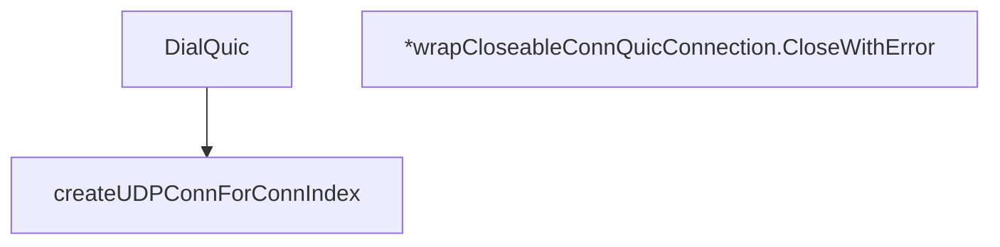

# Behavior Atom: connection/quic.go

## Source Anchor

- Go source: [cloudflare/cloudflared@2026.3.0/connection/quic.go](https://github.com/cloudflare/cloudflared/blob/2026.3.0/connection/quic.go)
- Package: connection
- Module group: connection

## Behavioral Responsibility

Transport/protocol behavior for edge-origin data and control flows.

## Entry Points

- DialQuic(ctx context.Context, quicConfig *quic.Config, tlsConfig*tls.Config, edgeAddr netip.AddrPort, localAddr net.IP, connIndex uint8, logger *zerolog.Logger) (quic.Connection, error) (line 21)
- (*wrapCloseableConnQuicConnection) CloseWithError(errorCode quic.ApplicationErrorCode, reason string) error (line 96)

## Internal Function Surface

- createUDPConnForConnIndex(connIndex uint8, localIP net.IP, edgeIP netip.AddrPort, logger *zerolog.Logger) (*net.UDPConn, error) (line 50)

## Input Contract

- func-param:connIndex uint8
- func-param:ctx context.Context
- func-param:edgeAddr netip.AddrPort
- func-param:edgeIP netip.AddrPort
- func-param:errorCode quic.ApplicationErrorCode
- func-param:localAddr net.IP
- func-param:localIP net.IP
- func-param:logger *zerolog.Logger
- func-param:quicConfig *quic.Config
- func-param:reason string
- func-param:tlsConfig *tls.Config

## Output Contract

- return:*net.UDPConn
- return:error
- return:quic.Connection
- stdout/stderr or structured logs

## Side Effects and State Transitions

- network I/O
- concurrency primitives

## Branching and Failure Semantics

- Branch density: if=8, switch=0, select=0
- error-return paths

## Import and Dependency Surface

- context
- crypto/tls
- fmt
- github.com/quic-go/quic-go
- github.com/rs/zerolog
- net
- net/netip
- runtime
- sync

## Go-Impl Flow (Intra-file)

## Accuracy Notes

- Generated from Go AST parsing and source text pattern extraction.
- Source link is authoritative for disputed semantics; keep this atom synchronized with the linked file.

## Rust Porting Notes

- **QUIC dialing**: `quic-go.DialAddr` → `quinn::Endpoint::connect` with matching transport config (initial window, max streams, keep-alive).
- **TLS configuration**: `crypto/tls.Config` → `rustls::ClientConfig` with ALPN set to match edge expectations (e.g., `h3`).
- **Local address binding**: `net.ListenPacket` for UDP socket → `std::net::UdpSocket::bind` then pass to `quinn::Endpoint::new`.
- **Close wrapper**: `wrapCloseableConnQuicConnection` adds `sync.Once`-guarded close → Rust `Drop` impl on a newtype wrapper, or `Arc<quinn::Connection>` with explicit shutdown method.
- **Platform GOMAXPROCS**: `runtime.GOMAXPROCS(0)` for connection pool sizing → `std::thread::available_parallelism()` for equivalent CPU count.
- **Quirk — 8 if-branches**: Light branching; keep the Rust port equally lean as a thin dialing wrapper.
