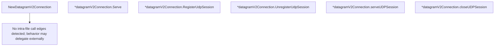

# Behavior Atom: connection/quic_datagram_v2.go

## Source Anchor

- Go source: [cloudflare/cloudflared@2026.3.0/connection/quic_datagram_v2.go](https://github.com/cloudflare/cloudflared/blob/2026.3.0/connection/quic_datagram_v2.go)
- Package: connection
- Module group: connection

## Behavioral Responsibility

Transport/protocol behavior for edge-origin data and control flows.

## Entry Points

- NewDatagramV2Connection(ctx context.Context, conn quic.Connection, originDialer ingress.OriginUDPDialer, icmpRouter ingress.ICMPRouter, index uint8, rpcTimeout time.Duration, streamWriteTimeout time.Duration, flowLimiter cfdflow.Limiter, logger *zerolog.Logger) DatagramSessionHandler (line 71)
- (*datagramV2Connection) Serve(ctx context.Context) error (line 100)
- (*datagramV2Connection) RegisterUdpSession(ctx context.Context, sessionID uuid.UUID, dstIP net.IP, dstPort uint16, closeAfterIdleHint time.Duration, traceContext string) (*tunnelpogs.RegisterUdpSessionResponse, error) (line 119)
- (*datagramV2Connection) UnregisterUdpSession(ctx context.Context, sessionID uuid.UUID, message string) error (line 196)

## Internal Function Surface

- (*datagramV2Connection) serveUDPSession(session*datagramsession.Session, closeAfterIdleHint time.Duration) (line 200)
- (*datagramV2Connection) closeUDPSession(ctx context.Context, sessionID uuid.UUID, message string) (line 218)

## Input Contract

- func-param:closeAfterIdleHint time.Duration
- func-param:conn quic.Connection
- func-param:ctx context.Context
- func-param:dstIP net.IP
- func-param:dstPort uint16
- func-param:flowLimiter cfdflow.Limiter
- func-param:icmpRouter ingress.ICMPRouter
- func-param:index uint8
- func-param:logger *zerolog.Logger
- func-param:message string
- func-param:originDialer ingress.OriginUDPDialer
- func-param:rpcTimeout time.Duration
- func-param:session *datagramsession.Session
- func-param:sessionID uuid.UUID
- func-param:streamWriteTimeout time.Duration
- func-param:traceContext string

## Output Contract

- return:*tunnelpogs.RegisterUdpSessionResponse
- return:DatagramSessionHandler
- return:error
- stdout/stderr or structured logs

## Side Effects and State Transitions

- network I/O
- concurrency primitives

## Branching and Failure Semantics

- Branch density: if=10, switch=0, select=0
- error-return paths

## Import and Dependency Surface

- context
- fmt
- github.com/cloudflare/cloudflared/datagramsession
- github.com/cloudflare/cloudflared/flow
- github.com/cloudflare/cloudflared/ingress
- github.com/cloudflare/cloudflared/management
- github.com/cloudflare/cloudflared/packet
- github.com/cloudflare/cloudflared/quic
- github.com/cloudflare/cloudflared/tracing
- github.com/cloudflare/cloudflared/tunnelrpc/pogs
- github.com/cloudflare/cloudflared/tunnelrpc/pogs
- github.com/cloudflare/cloudflared/tunnelrpc/quic
- github.com/google/uuid
- github.com/pkg/errors
- github.com/pkg/errors
- github.com/quic-go/quic-go
- github.com/rs/zerolog
- go.opentelemetry.io/otel/attribute
- go.opentelemetry.io/otel/trace
- golang.org/x/sync/errgroup
- net
- net/netip
- time

## Go-Impl Flow (Intra-file)

## Accuracy Notes

- Generated from Go AST parsing and source text pattern extraction.
- Source link is authoritative for disputed semantics; keep this atom synchronized with the linked file.

## Rust Porting Notes

- **Session manager**: `datagramsession.Manager` → `SessionManager` trait with async `register`/`unregister` methods.
- **Flow limiter**: `cfdflow.Limiter` interface → `tower::limit` or a custom `Semaphore`-based `FlowLimiter` trait.
- **UUID handling**: `google/uuid` → `uuid` crate with `Uuid::from_bytes` for wire deserialization.
- **OpenTelemetry**: `go.opentelemetry.io/otel/trace` + `attribute` → `tracing` crate with `opentelemetry-tracing` bridge for span propagation.
- **Task group**: `errgroup.Group` for concurrent datagram/RPC serving → `tokio::task::JoinSet` or `tokio::select!` on multiple futures.
- **ICMP routing**: `ingress.ICMPRouter` interface → async trait for ICMP packet handling; platform-dependent raw socket implementation.
- **Quirk — dual error wrapping**: Both `pkg/errors` and `fmt.Errorf` used for error context — standardize on `thiserror` enums for typed errors in the Rust port.
