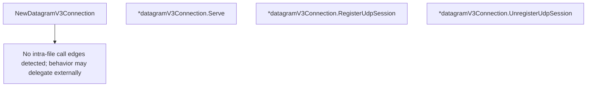

# Behavior Atom: connection/quic_datagram_v3.go

## Source Anchor

- Go source: [cloudflare/cloudflared@2026.3.0/connection/quic_datagram_v3.go](https://github.com/cloudflare/cloudflared/blob/2026.3.0/connection/quic_datagram_v3.go)
- Package: connection
- Module group: connection

## Behavioral Responsibility

Transport/protocol behavior for edge-origin data and control flows.

## Entry Points

- NewDatagramV3Connection(ctx context.Context, conn quic.Connection, sessionManager cfdquic.SessionManager, icmpRouter ingress.ICMPRouter, index uint8, metrics cfdquic.Metrics, logger *zerolog.Logger) DatagramSessionHandler (line 33)
- (*datagramV3Connection) Serve(ctx context.Context) error (line 57)
- (*datagramV3Connection) RegisterUdpSession(ctx context.Context, sessionID uuid.UUID, dstIP net.IP, dstPort uint16, closeAfterIdleHint time.Duration, traceContext string) (*pogs.RegisterUdpSessionResponse, error) (line 61)
- (*datagramV3Connection) UnregisterUdpSession(ctx context.Context, sessionID uuid.UUID, message string) error (line 66)

## Internal Function Surface

- None detected.

## Input Contract

- func-param:closeAfterIdleHint time.Duration
- func-param:conn quic.Connection
- func-param:ctx context.Context
- func-param:dstIP net.IP
- func-param:dstPort uint16
- func-param:icmpRouter ingress.ICMPRouter
- func-param:index uint8
- func-param:logger *zerolog.Logger
- func-param:message string
- func-param:metrics cfdquic.Metrics
- func-param:sessionID uuid.UUID
- func-param:sessionManager cfdquic.SessionManager
- func-param:traceContext string

## Output Contract

- metrics emission
- return:*pogs.RegisterUdpSessionResponse
- return:DatagramSessionHandler
- return:error
- stdout/stderr or structured logs

## Side Effects and State Transitions

- network I/O
- subprocess execution

## Branching and Failure Semantics

- Branch density: if=0, switch=0, select=0
- No explicit failure pattern markers found in static scan.

## Import and Dependency Surface

- context
- github.com/cloudflare/cloudflared/ingress
- github.com/cloudflare/cloudflared/management
- github.com/cloudflare/cloudflared/quic/v3
- github.com/cloudflare/cloudflared/tunnelrpc/pogs
- github.com/google/uuid
- github.com/pkg/errors
- github.com/quic-go/quic-go
- github.com/rs/zerolog
- net
- time

## Go-Impl Flow (Intra-file)

## Accuracy Notes

- Generated from Go AST parsing and source text pattern extraction.
- Source link is authoritative for disputed semantics; keep this atom synchronized with the linked file.

## Rust Porting Notes

- **Thin wrapper**: V3 delegates most logic to `quic/v3.SessionManager` — the Rust port should remain a thin adapter between the QUIC connection and session manager.
- **Session manager trait**: `cfdquic.SessionManager` → same `SessionManager` trait used by the muxer; inject via constructor.
- **QUIC connection**: `quic-go.Connection` → `quinn::Connection`; datagram reception via `conn.read_datagram().await`.
- **ICMP router**: Same `ingress.ICMPRouter` interface as v2 → shared async trait implementation.
- **Zero branching**: No if/switch/select — all logic delegated; the Rust port should preserve this simplicity.
- **Quirk — subprocess execution side effect**: The atom metadata reports subprocess execution, likely from ICMP router interaction — verify this is actually raw socket I/O rather than process spawning in the Rust port.
