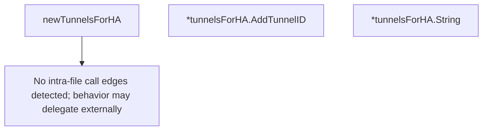

# Behavior Atom: connection/tunnelsforha.go

## Source Anchor

- Go source: [cloudflare/cloudflared@2026.3.0/connection/tunnelsforha.go](https://github.com/cloudflare/cloudflared/blob/2026.3.0/connection/tunnelsforha.go)
- Package: connection
- Module group: connection

## Behavioral Responsibility

Transport/protocol behavior for edge-origin data and control flows.

## Entry Points

- (*tunnelsForHA) AddTunnelID(haConn uint8, tunnelID string) (line 35)
- (*tunnelsForHA) String() string (line 46)

## Internal Function Surface

- newTunnelsForHA() tunnelsForHA (line 18)

## Input Contract

- func-param:haConn uint8
- func-param:tunnelID string

## Output Contract

- metrics emission
- return:string
- return:tunnelsForHA

## Side Effects and State Transitions

- concurrency primitives

## Branching and Failure Semantics

- Branch density: if=1, switch=0, select=0
- No explicit failure pattern markers found in static scan.

## Import and Dependency Surface

- fmt
- github.com/prometheus/client_golang/prometheus
- sync

## Go-Impl Flow (Intra-file)

## Accuracy Notes

- Generated from Go AST parsing and source text pattern extraction.
- Source link is authoritative for disputed semantics; keep this atom synchronized with the linked file.

## Rust Porting Notes

- **HA tunnel registry**: `tunnelsForHA` with `sync.Mutex` → `tokio::sync::Mutex<Vec<Option<String>>>` or `parking_lot::Mutex` for sync access.
- **Prometheus label**: `String()` method formats tunnel IDs for metrics labels → implement `Display` trait for the registry type.
- **Connection index**: `haConn uint8` used as array index → bounds-check with `ConnIndex(u8)` newtype and `get_mut` for safe access.
- **Minimal complexity**: Only 1 if-branch; the Rust port should remain a simple registry struct.
