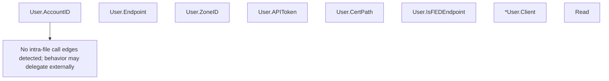

# Behavior Atom: credentials/credentials.go

## Source Anchor

- Go source: [cloudflare/cloudflared@2026.3.0/credentials/credentials.go](https://github.com/cloudflare/cloudflared/blob/2026.3.0/credentials/credentials.go)
- Package: credentials
- Module group: credentials

## Behavioral Responsibility

Configuration, identity, and credential handling behavior.

## Entry Points

- (User) AccountID() string (line 22)
- (User) Endpoint() string (line 26)
- (User) ZoneID() string (line 30)
- (User) APIToken() string (line 34)
- (User) CertPath() string (line 38)
- (User) IsFEDEndpoint() bool (line 42)
- (*User) Client(apiURL string, userAgent string, log*zerolog.Logger) (cfapi.Client, error) (line 47)
- Read(originCertPath string, log *zerolog.Logger) (*User, error) (line 66)

## Internal Function Surface

- None detected.

## Input Contract

- func-param:apiURL string
- func-param:log *zerolog.Logger
- func-param:originCertPath string
- func-param:userAgent string

## Output Contract

- return:*User
- return:bool
- return:cfapi.Client
- return:error
- return:string
- stdout/stderr or structured logs

## Side Effects and State Transitions

- No high-signal side effect pattern detected in static scan.

## Branching and Failure Semantics

- Branch density: if=6, switch=0, select=0
- error-return paths

## Import and Dependency Surface

- github.com/cloudflare/cloudflared/cfapi
- github.com/pkg/errors
- github.com/rs/zerolog

## Go-Impl Flow (Intra-file)

## Rust Porting Notes

- **Client factory interface**: Returns `cfapi.Client` via interface → `fn build_client(…) -> Box<dyn TunnelClient>` or generic return.
- **Error wrapping**: `pkg/errors.Wrap` → `anyhow::Context` or `thiserror`.
- **Quirk — 6 if-branches**: Credential validation checks; straightforward `?` chain.

## Accuracy Notes

- Generated from Go AST parsing and source text pattern extraction.
- Source link is authoritative for disputed semantics; keep this atom synchronized with the linked file.
