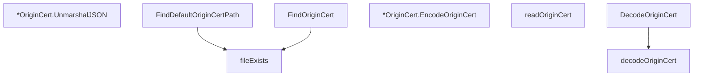

# Behavior Atom: credentials/origin_cert.go

## Source Anchor

- Go source: [cloudflare/cloudflared@2026.3.0/credentials/origin_cert.go](https://github.com/cloudflare/cloudflared/blob/2026.3.0/credentials/origin_cert.go)
- Package: credentials
- Module group: credentials

## Behavioral Responsibility

Configuration, identity, and credential handling behavior.

## Entry Points

- (*OriginCert) UnmarshalJSON(data []byte) error (line 29)
- FindDefaultOriginCertPath() string (line 48)
- DecodeOriginCert(blocks []byte) (*OriginCert, error) (line 58)
- (*OriginCert) EncodeOriginCert() ([]byte, error) (line 62)
- FindOriginCert(originCertPath string, log *zerolog.Logger) (string, error) (line 123)

## Internal Function Surface

- decodeOriginCert(blocks []byte) (*OriginCert, error) (line 83)
- readOriginCert(originCertPath string) ([]byte, error) (line 113)
- fileExists(path string) bool (line 153)

## Input Contract

- func-param:blocks []byte
- func-param:data []byte
- func-param:log *zerolog.Logger
- func-param:originCertPath string
- func-param:path string
- serialized configuration payloads

## Output Contract

- return:*OriginCert
- return:[]byte
- return:bool
- return:error
- return:string
- stdout/stderr or structured logs

## Side Effects and State Transitions

- filesystem I/O

## Branching and Failure Semantics

- Branch density: if=13, switch=1, select=0
- error-return paths
- fallback/default branches

## Import and Dependency Surface

- bytes
- encoding/json
- encoding/pem
- fmt
- github.com/cloudflare/cloudflared/config
- github.com/mitchellh/go-homedir
- github.com/rs/zerolog
- os
- path/filepath
- strings

## Go-Impl Flow (Intra-file)

## Rust Porting Notes

- **PEM/JSON cert decoding**: `encoding/pem.Decode` + `x509.ParseCertificate` → `pem::parse()` + `x509_parser::parse_x509_pem()` or `rustls_pemfile`.
- **Home dir**: `go-homedir` for `~` expansion → `dirs::home_dir()`.
- **Quirk — 13 if + 1 switch**: Format detection (PEM vs JSON) + validation; use `match` on detected format.

## Accuracy Notes

- Generated from Go AST parsing and source text pattern extraction.
- Source link is authoritative for disputed semantics; keep this atom synchronized with the linked file.
