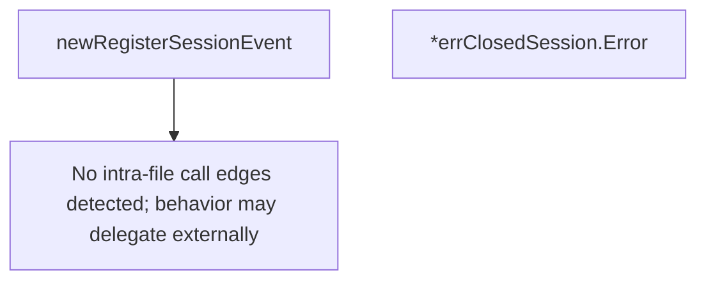

# Behavior Atom: datagramsession/event.go

## Source Anchor

- Go source: [cloudflare/cloudflared@2026.3.0/datagramsession/event.go](https://github.com/cloudflare/cloudflared/blob/2026.3.0/datagramsession/event.go)
- Package: datagramsession
- Module group: datagramsession

## Behavioral Responsibility

Core package behavior anchored to this source file.

## Entry Points

- (*errClosedSession) Error() string (line 38)

## Internal Function Surface

- newRegisterSessionEvent(sessionID uuid.UUID, originProxy io.ReadWriteCloser) *registerSessionEvent (line 17)

## Input Contract

- func-param:originProxy io.ReadWriteCloser
- func-param:sessionID uuid.UUID

## Output Contract

- return:*registerSessionEvent
- return:string

## Side Effects and State Transitions

- No high-signal side effect pattern detected in static scan.

## Branching and Failure Semantics

- Branch density: if=1, switch=0, select=0
- error-return paths

## Import and Dependency Surface

- fmt
- github.com/google/uuid
- io

## Go-Impl Flow (Intra-file)

## Rust Porting Notes

- **Event data types**: `uuid.UUID` + `io.ReadWriteCloser` interface → `uuid::Uuid` + `tokio::io::AsyncRead + AsyncWrite + Unpin`.
- **Quirk — 1 if-branch**: Minimal; direct struct translation.

## Accuracy Notes

- Generated from Go AST parsing and source text pattern extraction.
- Source link is authoritative for disputed semantics; keep this atom synchronized with the linked file.
