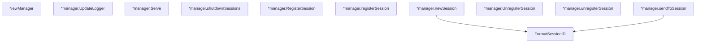

# Behavior Atom: datagramsession/manager.go

## Source Anchor

- Go source: [cloudflare/cloudflared@2026.3.0/datagramsession/manager.go](https://github.com/cloudflare/cloudflared/blob/2026.3.0/datagramsession/manager.go)
- Package: datagramsession
- Module group: datagramsession

## Behavioral Responsibility

Core package behavior anchored to this source file.

## Entry Points

- FormatSessionID(sessionID uuid.UUID) string (line 27)
- NewManager(log *zerolog.Logger, sendF transportSender, receiveChan <-chan*packet.Session) *manager (line 57)
- (*manager) UpdateLogger(log*zerolog.Logger) (line 70)
- (*manager) Serve(ctx context.Context) error (line 75)
- (*manager) RegisterSession(ctx context.Context, sessionID uuid.UUID, originProxy io.ReadWriteCloser) (*Session, error) (line 110)
- (*manager) UnregisterSession(ctx context.Context, sessionID uuid.UUID, message string, byRemote bool) error (line 152)

## Internal Function Surface

- (*manager) shutdownSessions(err error) (line 93)
- (*manager) registerSession(ctx context.Context, registration*registerSessionEvent) (line 128)
- (*manager) newSession(id uuid.UUID, dstConn io.ReadWriteCloser)*Session (line 135)
- (*manager) unregisterSession(unregistration*unregisterSessionEvent) (line 173)
- (*manager) sendToSession(datagram*packet.Session) (line 182)

## Input Contract

- func-param:byRemote bool
- func-param:ctx context.Context
- func-param:datagram *packet.Session
- func-param:dstConn io.ReadWriteCloser
- func-param:err error
- func-param:id uuid.UUID
- func-param:log *zerolog.Logger
- func-param:message string
- func-param:originProxy io.ReadWriteCloser
- func-param:receiveChan <-chan *packet.Session
- func-param:registration *registerSessionEvent
- func-param:sendF transportSender
- func-param:sessionID uuid.UUID
- func-param:unregistration *unregisterSessionEvent

## Output Contract

- return:*Session
- return:*manager
- return:error
- return:string
- stdout/stderr or structured logs

## Side Effects and State Transitions

- network I/O

## Branching and Failure Semantics

- Branch density: if=3, switch=0, select=3
- error-return paths

## Import and Dependency Surface

- context
- fmt
- github.com/cloudflare/cloudflared/management
- github.com/cloudflare/cloudflared/packet
- github.com/google/uuid
- github.com/rs/zerolog
- io
- strings
- time

## Go-Impl Flow (Intra-file)

## Accuracy Notes

- Generated from Go AST parsing and source text pattern extraction.
- Source link is authoritative for disputed semantics; keep this atom synchronized with the linked file.

## Rust Porting Notes

- **Session registry**: `map[uuid.UUID]*Session` behind implicit lock → `DashMap<Uuid, SessionHandle>` or `tokio::sync::RwLock<HashMap<Uuid, SessionHandle>>`.
- **Transport sender**: `transportSender` function type → `Fn` trait bound or `tokio::sync::mpsc::Sender<Packet>` for outbound datagram dispatch.
- **Receive channel**: `<-chan *packet.Session` → `tokio::sync::mpsc::Receiver<SessionPacket>` for inbound datagram routing.
- **Select loop**: 3 `select` statements for receive/context/timeout → `tokio::select!` in the `Serve` async method.
- **Session format**: `FormatSessionID` UUID formatting → `uuid::Uuid::to_string()` or `Display` impl.
- **Logger update**: `UpdateLogger` swaps logger at runtime → `tracing` subscriber with runtime level changes, or `Arc<RwLock<Logger>>` if direct swap needed.
- **Quirk — event management bridge**: `management.EventSink` integration for session lifecycle events — forward to a `tokio::sync::broadcast` channel.
