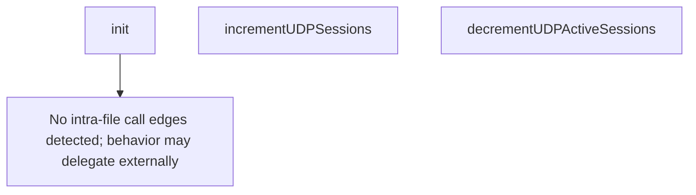

# Behavior Atom: datagramsession/metrics.go

## Source Anchor

- Go source: [cloudflare/cloudflared@2026.3.0/datagramsession/metrics.go](https://github.com/cloudflare/cloudflared/blob/2026.3.0/datagramsession/metrics.go)
- Package: datagramsession
- Module group: datagramsession

## Behavioral Responsibility

Core package behavior anchored to this source file.

## Entry Points

- init() (line 26)

## Internal Function Surface

- incrementUDPSessions() (line 33)
- decrementUDPActiveSessions() (line 38)

## Input Contract

- Inputs are indirect through callers; no direct input pattern detected statically.

## Output Contract

- metrics emission

## Side Effects and State Transitions

- No high-signal side effect pattern detected in static scan.

## Branching and Failure Semantics

- Branch density: if=0, switch=0, select=0
- No explicit failure pattern markers found in static scan.

## Import and Dependency Surface

- github.com/prometheus/client_golang/prometheus

## Go-Impl Flow (Intra-file)

## Accuracy Notes

- Generated from Go AST parsing and source text pattern extraction.
- Source link is authoritative for disputed semantics; keep this atom synchronized with the linked file.

## Rust Porting Notes

- **Prometheus metrics**: Go `init()` function registering prometheus collectors → `prometheus::register_int_counter_vec!` or `metrics` crate macros (`counter!`, `gauge!`) at module level.
- **Global registry**: Go package-level `init()` for metric registration → `std::sync::LazyLock` with `prometheus::Registry` or use `metrics` crate's global recorder.
- **Zero branching**: Pure metrics declaration file; the Rust port should be equally trivial — declare metric descriptors as constants.
