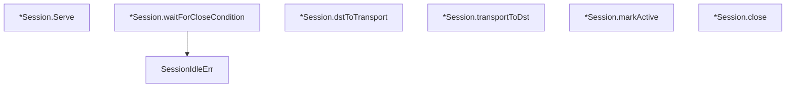

# Behavior Atom: datagramsession/session.go

## Source Anchor

- Go source: [cloudflare/cloudflared@2026.3.0/datagramsession/session.go](https://github.com/cloudflare/cloudflared/blob/2026.3.0/datagramsession/session.go)
- Package: datagramsession
- Module group: datagramsession

## Behavioral Responsibility

Core package behavior anchored to this source file.

## Entry Points

- SessionIdleErr(timeout time.Duration) error (line 21)
- (*Session) Serve(ctx context.Context, closeAfterIdle time.Duration) (closedByRemote bool, err error) (line 52)

## Internal Function Surface

- (*Session) waitForCloseCondition(ctx context.Context, closeAfterIdle time.Duration) error (line 83)
- (*Session) dstToTransport(buffer []byte) (closeSession bool, err error) (line 113)
- (*Session) transportToDst(payload []byte) (int, error) (line 129)
- (*Session) markActive() (line 140)
- (*Session) close(err*errClosedSession) (line 147)

## Input Contract

- func-param:buffer []byte
- func-param:closeAfterIdle time.Duration
- func-param:ctx context.Context
- func-param:err *errClosedSession
- func-param:payload []byte
- func-param:timeout time.Duration

## Output Contract

- HTTP response writes
- return:closeSession bool
- return:closedByRemote bool
- return:err error
- return:error
- return:int
- stdout/stderr or structured logs

## Side Effects and State Transitions

- network I/O
- concurrency primitives
- timers and scheduling

## Branching and Failure Semantics

- Branch density: if=10, switch=0, select=2
- error-return paths
- fallback/default branches

## Import and Dependency Surface

- context
- errors
- fmt
- github.com/cloudflare/cloudflared/packet
- github.com/google/uuid
- github.com/rs/zerolog
- io
- net
- time

## Go-Impl Flow (Intra-file)

## Accuracy Notes

- Generated from Go AST parsing and source text pattern extraction.
- Source link is authoritative for disputed semantics; keep this atom synchronized with the linked file.

## Rust Porting Notes

- **Session lifecycle**: `Serve` goroutine with idle timeout → `tokio::spawn` task using `tokio::select!` on origin reads, datagram sends, idle timer, and cancellation.
- **Idle timeout**: `time.Timer` with reset on activity → `tokio::time::Sleep` wrapped in `Pin<Box<Sleep>>` with `reset()` on each packet.
- **Origin proxy**: `io.ReadWriteCloser` origin connection → `tokio::io::AsyncRead + AsyncWrite` trait object.
- **Closed-by-remote tracking**: Return value `closedByRemote bool` → model as `SessionCloseReason` enum (`Idle`, `Remote`, `Error`) for richer close semantics.
- **Packet channel**: Internal send/receive channels → `tokio::sync::mpsc` bounded channels with `Bytes` payloads.
- **Quirk — SessionIdleErr sentinel**: `SessionIdleErr` is a function returning a formatted error — in Rust, make it a `#[derive(thiserror::Error)]` variant with the timeout duration embedded.
- **Quirk — 2 select statements**: Both select on context + timer + I/O → combine into a single `tokio::select!` with three branches.
