# Behavior Atom: diagnostic/client.go

## Source Anchor

- Go source: [cloudflare/cloudflared@2026.3.0/diagnostic/client.go](https://github.com/cloudflare/cloudflared/blob/2026.3.0/diagnostic/client.go)
- Package: diagnostic
- Module group: diagnostic

## Behavioral Responsibility

Management, diagnostics, and observability behavior.

## Entry Points

- NewHTTPClient() *httpClient (line 20)
- (*httpClient) SetBaseURL(baseURL*url.URL) (line 35)
- (*httpClient) GET(ctx context.Context, endpoint string) (*http.Response, error) (line 39)
- (*httpClient) GetLogConfiguration(ctx context.Context) (*LogConfiguration, error) (line 66)
- (*httpClient) GetMemoryDump(ctx context.Context, writer io.Writer) error (line 104)
- (*httpClient) GetGoroutineDump(ctx context.Context, writer io.Writer) error (line 113)
- (*httpClient) GetTunnelState(ctx context.Context) (*TunnelState, error) (line 122)
- (*httpClient) GetSystemInformation(ctx context.Context, writer io.Writer) error (line 138)
- (*httpClient) GetMetrics(ctx context.Context, writer io.Writer) error (line 147)
- (*httpClient) GetTunnelConfiguration(ctx context.Context, writer io.Writer) error (line 156)
- (*httpClient) GetCliConfiguration(ctx context.Context, writer io.Writer) error (line 165)

## Internal Function Surface

- copyToWriter(response *http.Response, writer io.Writer) error (line 174)
- copyJSONToWriter(response *http.Response, writer io.Writer) error (line 185)

## Input Contract

- func-param:baseURL *url.URL
- func-param:ctx context.Context
- func-param:endpoint string
- func-param:response *http.Response
- func-param:writer io.Writer

## Output Contract

- return:*LogConfiguration
- return:*TunnelState
- return:*http.Response
- return:*httpClient
- return:error

## Side Effects and State Transitions

- network I/O

## Branching and Failure Semantics

- Branch density: if=20, switch=0, select=0
- error-return paths

## Import and Dependency Surface

- context
- encoding/json
- fmt
- github.com/cloudflare/cloudflared/cmd/cloudflared/flags
- io
- net/http
- net/url
- strconv

## Go-Impl Flow (Intra-file)

```mermaid
flowchart TD
    F1["NewHTTPClient"]
    F2["*httpClient.SetBaseURL"]
    F3["*httpClient.GET"]
    F4["*httpClient.GetLogConfiguration"]
    F5["*httpClient.GetMemoryDump"]
    F6["*httpClient.GetGoroutineDump"]
    F7["*httpClient.GetTunnelState"]
    F8["*httpClient.GetSystemInformation"]
    F9["*httpClient.GetMetrics"]
    F10["*httpClient.GetTunnelConfiguration"]
    F11["*httpClient.GetCliConfiguration"]
    F12["copyToWriter"]
    F13["copyJSONToWriter"]
    F5 --> F12
    F6 --> F12
    F8 --> F13
    F9 --> F12
    F10 --> F13
    F11 --> F13
```

## Rust Porting Notes

- **HTTP diagnostic client**: `httpClient` queries management endpoints for JSON responses → `reqwest::Client` with typed response deserialization via `serde_json`.
- **Multiple response types**: Memory dumps, goroutine profiles, tunnel state → Rust enum `DiagnosticResponse { Memory(MemInfo), Goroutines(String), TunnelState(State) }` with per-variant parsing.
- **Quirk — 20 if-branches**: Response validation; use `reqwest::Response::error_for_status()?` + typed `Result` returns.

## Accuracy Notes

- Generated from Go AST parsing and source text pattern extraction.
- Source link is authoritative for disputed semantics; keep this atom synchronized with the linked file.
