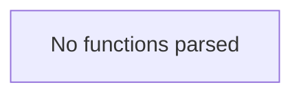

# Behavior Atom: diagnostic/consts.go

## Source Anchor

- Go source: [cloudflare/cloudflared@2026.3.0/diagnostic/consts.go](https://github.com/cloudflare/cloudflared/blob/2026.3.0/diagnostic/consts.go)
- Package: diagnostic
- Module group: diagnostic

## Behavioral Responsibility

Management, diagnostics, and observability behavior.

## Entry Points

- No exported/main/init entry point detected; behavior is internal support logic.

## Internal Function Surface

- None detected.

## Input Contract

- Inputs are indirect through callers; no direct input pattern detected statically.

## Output Contract

- metrics emission

## Side Effects and State Transitions

- No high-signal side effect pattern detected in static scan.

## Branching and Failure Semantics

- Branch density: if=0, switch=0, select=0
- No explicit failure pattern markers found in static scan.

## Import and Dependency Surface

- time

## Go-Impl Flow (Intra-file)

## Rust Porting Notes

- **Time constants**: Timeout and interval durations → `const TIMEOUT: Duration = Duration::from_secs(N)`.
- **Quirk — no logic**: Pure constant definitions; direct transcription.

## Accuracy Notes

- Generated from Go AST parsing and source text pattern extraction.
- Source link is authoritative for disputed semantics; keep this atom synchronized with the linked file.
