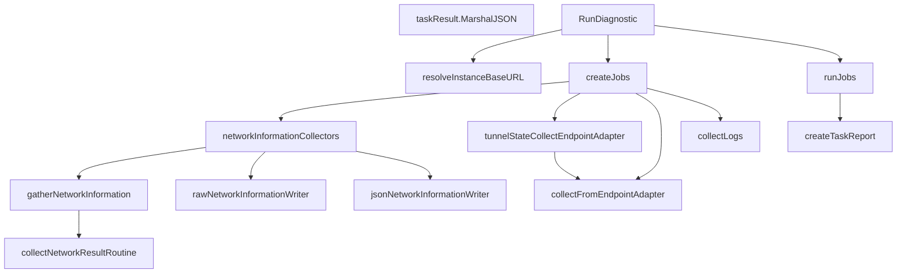

# Behavior Atom: diagnostic/diagnostic.go

## Source Anchor

- Go source: [cloudflare/cloudflared@2026.3.0/diagnostic/diagnostic.go](https://github.com/cloudflare/cloudflared/blob/2026.3.0/diagnostic/diagnostic.go)
- Package: diagnostic
- Module group: diagnostic

## Behavioral Responsibility

Management, diagnostics, and observability behavior.

## Entry Points

- (taskResult) MarshalJSON() ([]byte, error) (line 44)
- RunDiagnostic(log *zerolog.Logger, options Options) ([]*AddressableTunnelState, error) (line 503)

## Internal Function Surface

- collectLogs(ctx context.Context, client HTTPClient, diagContainer string, diagPod string) (string, error) (line 98)
- collectNetworkResultRoutine(ctx context.Context, collector network.NetworkCollector, hostname string, useIPv4 bool, results chan networkCollectionResult) (line 145)
- gatherNetworkInformation(ctx context.Context) map[string]networkCollectionResult (line 169)
- networkInformationCollectors() (rawNetworkCollector collectFunc, jsonNetworkCollector collectFunc) (line 209)
- rawNetworkInformationWriter(resultMap map[string]networkCollectionResult) (string, error) (line 231)
- jsonNetworkInformationWriter(resultMap map[string]networkCollectionResult) (string, error) (line 262)
- collectFromEndpointAdapter(collect collectToWriterFunc, fileName string) collectFunc (line 291)
- tunnelStateCollectEndpointAdapter(client HTTPClient, tunnel *TunnelState, fileName string) collectFunc (line 308)
- resolveInstanceBaseURL(metricsServerAddress string, log *zerolog.Logger, client*httpClient, addresses []string) (*url.URL,*TunnelState, []*AddressableTunnelState, error) (line 342)
- createJobs(client *httpClient, tunnel*TunnelState, diagContainer string, diagPod string, noDiagSystem bool, noDiagRuntime bool, noDiagMetrics bool, noDiagLogs bool, noDiagNetwork bool) []collectJob (line 368)
- createTaskReport(taskReport map[string]taskResult) (string, error) (line 438)
- runJobs(ctx context.Context, jobs []collectJob, log *zerolog.Logger) map[string]taskResult (line 455)

## Input Contract

- func-param:addresses []string
- func-param:client *httpClient
- func-param:client HTTPClient
- func-param:collect collectToWriterFunc
- func-param:collector network.NetworkCollector
- func-param:ctx context.Context
- func-param:diagContainer string
- func-param:diagPod string
- func-param:fileName string
- func-param:hostname string
- func-param:jobs []collectJob
- func-param:log *zerolog.Logger
- func-param:metricsServerAddress string
- func-param:noDiagLogs bool
- func-param:noDiagMetrics bool
- func-param:noDiagNetwork bool
- func-param:noDiagRuntime bool
- func-param:noDiagSystem bool
- func-param:options Options
- func-param:resultMap map[string]networkCollectionResult
- func-param:results chan networkCollectionResult
- func-param:taskReport map[string]taskResult
- func-param:tunnel *TunnelState
- func-param:useIPv4 bool

## Output Contract

- filesystem writes
- return:*TunnelState
- return:*url.URL
- return:[]*AddressableTunnelState
- return:[]byte
- return:[]collectJob
- return:collectFunc
- return:error
- return:jsonNetworkCollector collectFunc
- return:map[string]networkCollectionResult
- return:map[string]taskResult
- return:rawNetworkCollector collectFunc
- return:string
- stdout/stderr or structured logs

## Side Effects and State Transitions

- network I/O
- filesystem I/O
- concurrency primitives

## Branching and Failure Semantics

- Branch density: if=36, switch=0, select=0
- error-return paths

## Import and Dependency Surface

- context
- encoding/json
- errors
- fmt
- github.com/cloudflare/cloudflared/diagnostic/network
- github.com/rs/zerolog
- io
- net/url
- os
- path/filepath
- strings
- sync
- time

## Go-Impl Flow (Intra-file)

## Rust Porting Notes

- **Concurrent job orchestration**: `RunDiagnostic` launches multiple collectors in parallel → `tokio::task::JoinSet` collecting results into `Vec<DiagnosticResult>`.
- **Error aggregation**: Multiple jobs may fail independently → collect `Result`s and report partial success.
- **Quirk — 36 if-branches**: Heavy branching for job scheduling/result handling; decompose into per-collector async functions and aggregate with `futures::future::join_all()`.

## Accuracy Notes

- Generated from Go AST parsing and source text pattern extraction.
- Source link is authoritative for disputed semantics; keep this atom synchronized with the linked file.
