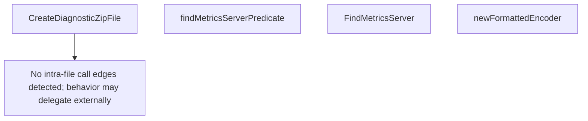

# Behavior Atom: diagnostic/diagnostic_utils.go

## Source Anchor

- Go source: [cloudflare/cloudflared@2026.3.0/diagnostic/diagnostic_utils.go](https://github.com/cloudflare/cloudflared/blob/2026.3.0/diagnostic/diagnostic_utils.go)
- Package: diagnostic
- Module group: diagnostic

## Behavioral Responsibility

Management, diagnostics, and observability behavior.

## Entry Points

- CreateDiagnosticZipFile(base string, paths []string) (zipFileName string, err error) (line 23)
- FindMetricsServer(log *zerolog.Logger, client*httpClient, addresses []string) (*AddressableTunnelState, []*AddressableTunnelState, error) (line 107)

## Internal Function Surface

- findMetricsServerPredicate(tunnelID uuid.UUID, connectorID uuid.UUID) func(state *TunnelState) bool (line 82)
- newFormattedEncoder(w io.Writer) *json.Encoder (line 144)

## Input Contract

- func-param:addresses []string
- func-param:base string
- func-param:client *httpClient
- func-param:connectorID uuid.UUID
- func-param:log *zerolog.Logger
- func-param:paths []string
- func-param:tunnelID uuid.UUID
- func-param:w io.Writer

## Output Contract

- filesystem writes
- return:*AddressableTunnelState
- return:*json.Encoder
- return:[]*AddressableTunnelState
- return:err error
- return:error
- return:func(state *TunnelState) bool
- return:zipFileName string
- stdout/stderr or structured logs

## Side Effects and State Transitions

- network I/O
- filesystem I/O

## Branching and Failure Semantics

- Branch density: if=13, switch=0, select=0
- error-return paths

## Import and Dependency Surface

- archive/zip
- context
- encoding/json
- fmt
- github.com/google/uuid
- github.com/rs/zerolog
- io
- net/url
- os
- path/filepath
- strings
- time

## Go-Impl Flow (Intra-file)

## Rust Porting Notes

- **Zip file creation**: `CreateDiagnosticZipFile` → `zip::ZipWriter` from the `zip` crate writing to `std::fs::File`.
- **Metrics server discovery**: `FindMetricsServer` resolves listener by UUID matching → `Uuid::parse_str()` + network endpoint lookup.
- **Quirk — 13 if-branches**: File I/O error handling; use `?` operator chains.

## Accuracy Notes

- Generated from Go AST parsing and source text pattern extraction.
- Source link is authoritative for disputed semantics; keep this atom synchronized with the linked file.
