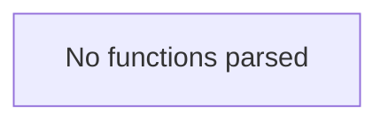

# Behavior Atom: diagnostic/error.go

## Source Anchor

- Go source: [cloudflare/cloudflared@2026.3.0/diagnostic/error.go](https://github.com/cloudflare/cloudflared/blob/2026.3.0/diagnostic/error.go)
- Package: diagnostic
- Module group: diagnostic

## Behavioral Responsibility

Management, diagnostics, and observability behavior.

## Entry Points

- No exported/main/init entry point detected; behavior is internal support logic.

## Internal Function Surface

- None detected.

## Input Contract

- Inputs are indirect through callers; no direct input pattern detected statically.

## Output Contract

- metrics emission

## Side Effects and State Transitions

- network I/O

## Branching and Failure Semantics

- Branch density: if=0, switch=0, select=0
- No explicit failure pattern markers found in static scan.

## Import and Dependency Surface

- errors

## Go-Impl Flow (Intra-file)

## Rust Porting Notes

- **Error types**: Diagnostic error structs → `#[derive(thiserror::Error)]` enum with variants for each error category.
- **Quirk — zero branching**: Pure type definitions; direct translation.

## Accuracy Notes

- Generated from Go AST parsing and source text pattern extraction.
- Source link is authoritative for disputed semantics; keep this atom synchronized with the linked file.
