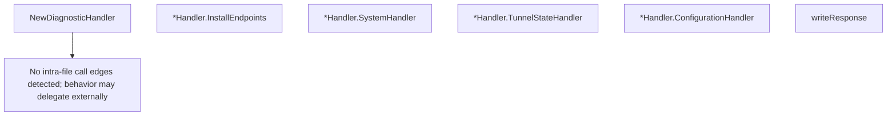

# Behavior Atom: diagnostic/handlers.go

## Source Anchor

- Go source: [cloudflare/cloudflared@2026.3.0/diagnostic/handlers.go](https://github.com/cloudflare/cloudflared/blob/2026.3.0/diagnostic/handlers.go)
- Package: diagnostic
- Module group: diagnostic

## Behavioral Responsibility

Management, diagnostics, and observability behavior.

## Entry Points

- NewDiagnosticHandler(log *zerolog.Logger, timeout time.Duration, systemCollector SystemCollector, tunnelID uuid.UUID, connectorID uuid.UUID, tracker*tunnelstate.ConnTracker, cliFlags map[string]string, icmpSources []string) *Handler (line 28)
- (*Handler) InstallEndpoints(router*http.ServeMux) (line 56)
- (*Handler) SystemHandler(writer http.ResponseWriter, request*http.Request) (line 67)
- (*Handler) TunnelStateHandler(writer http.ResponseWriter, _*http.Request) (line 99)
- (*Handler) ConfigurationHandler(writer http.ResponseWriter, _*http.Request) (line 120)

## Internal Function Surface

- writeResponse(w http.ResponseWriter, bytes []byte, logger *zerolog.Logger) (line 137)

## Input Contract

- HTTP requests
- func-param:_ *http.Request
- func-param:bytes []byte
- func-param:cliFlags map[string]string
- func-param:connectorID uuid.UUID
- func-param:icmpSources []string
- func-param:log *zerolog.Logger
- func-param:logger *zerolog.Logger
- func-param:request *http.Request
- func-param:router *http.ServeMux
- func-param:systemCollector SystemCollector
- func-param:timeout time.Duration
- func-param:tracker *tunnelstate.ConnTracker
- func-param:tunnelID uuid.UUID
- func-param:w http.ResponseWriter
- func-param:writer http.ResponseWriter

## Output Contract

- HTTP response writes
- return:*Handler
- stdout/stderr or structured logs

## Side Effects and State Transitions

- network I/O

## Branching and Failure Semantics

- Branch density: if=6, switch=0, select=0
- error-return paths

## Import and Dependency Surface

- context
- encoding/json
- github.com/cloudflare/cloudflared/tunnelstate
- github.com/google/uuid
- github.com/rs/zerolog
- net/http
- os
- strconv
- time

## Go-Impl Flow (Intra-file)

## Rust Porting Notes

- **HTTP handlers**: `Handler` serves diagnostic endpoints → `axum::Router` or `hyper` handlers returning JSON responses via `serde_json::to_string()`.
- **System info endpoint**: Returns host/tunnel/config data → structured `DiagnosticInfo` response type with `Serialize` derive.
- **Quirk — 6 if-branches**: Route matching and error handling; `axum` extractors handle most validation automatically.

## Accuracy Notes

- Generated from Go AST parsing and source text pattern extraction.
- Source link is authoritative for disputed semantics; keep this atom synchronized with the linked file.
