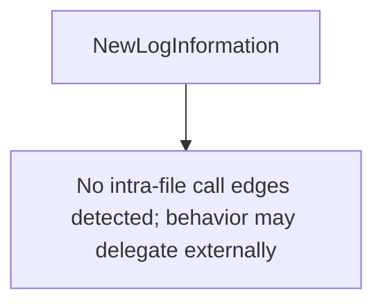

# Behavior Atom: diagnostic/log_collector.go

## Source Anchor

- Go source: [cloudflare/cloudflared@2026.3.0/diagnostic/log_collector.go](https://github.com/cloudflare/cloudflared/blob/2026.3.0/diagnostic/log_collector.go)
- Package: diagnostic
- Module group: diagnostic

## Behavioral Responsibility

Management, diagnostics, and observability behavior.

## Entry Points

- NewLogInformation(path string, wasCreated bool, isDirectory bool) *LogInformation (line 16)

## Internal Function Surface

- None detected.

## Input Contract

- func-param:isDirectory bool
- func-param:path string
- func-param:wasCreated bool

## Output Contract

- return:*LogInformation

## Side Effects and State Transitions

- No high-signal side effect pattern detected in static scan.

## Branching and Failure Semantics

- Branch density: if=0, switch=0, select=0
- No explicit failure pattern markers found in static scan.

## Import and Dependency Surface

- context

## Go-Impl Flow (Intra-file)

## Rust Porting Notes

- **Data type**: `LogInformation` struct → `struct LogInformation { source: String, content: Vec<u8> }` with `Serialize` derive.
- **Quirk — no logic**: Pure data definition; direct translation.

## Accuracy Notes

- Generated from Go AST parsing and source text pattern extraction.
- Source link is authoritative for disputed semantics; keep this atom synchronized with the linked file.
