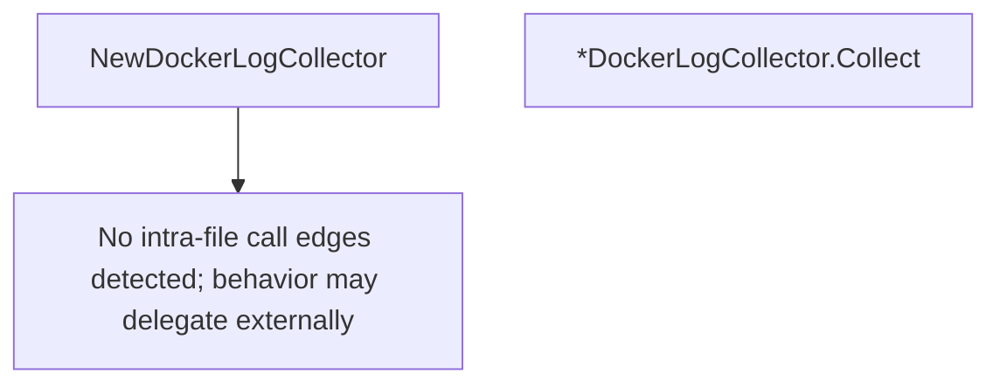

# Behavior Atom: diagnostic/log_collector_docker.go

## Source Anchor

- Go source: [cloudflare/cloudflared@2026.3.0/diagnostic/log_collector_docker.go](https://github.com/cloudflare/cloudflared/blob/2026.3.0/diagnostic/log_collector_docker.go)
- Package: diagnostic
- Module group: diagnostic

## Behavioral Responsibility

Management, diagnostics, and observability behavior.

## Entry Points

- NewDockerLogCollector(containerID string) *DockerLogCollector (line 16)
- (*DockerLogCollector) Collect(ctx context.Context) (*LogInformation, error) (line 22)

## Internal Function Surface

- None detected.

## Input Contract

- func-param:containerID string
- func-param:ctx context.Context

## Output Contract

- filesystem writes
- return:*DockerLogCollector
- return:*LogInformation
- return:error

## Side Effects and State Transitions

- filesystem I/O
- subprocess execution

## Branching and Failure Semantics

- Branch density: if=1, switch=0, select=0
- error-return paths

## Import and Dependency Surface

- context
- fmt
- os
- os/exec
- path/filepath
- time

## Go-Impl Flow (Intra-file)

## Rust Porting Notes

- **Docker log collection**: `DockerLogCollector` spawns `docker logs` subprocess → `tokio::process::Command::new("docker").args(&["logs", container_id]).output().await`.
- **Quirk — 1 if-branch**: Minimal; direct translation.

## Accuracy Notes

- Generated from Go AST parsing and source text pattern extraction.
- Source link is authoritative for disputed semantics; keep this atom synchronized with the linked file.
