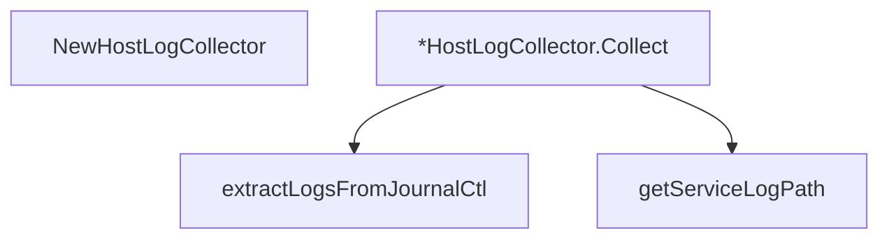

# Behavior Atom: diagnostic/log_collector_host.go

## Source Anchor

- Go source: [cloudflare/cloudflared@2026.3.0/diagnostic/log_collector_host.go](https://github.com/cloudflare/cloudflared/blob/2026.3.0/diagnostic/log_collector_host.go)
- Package: diagnostic
- Module group: diagnostic

## Behavioral Responsibility

Management, diagnostics, and observability behavior.

## Entry Points

- NewHostLogCollector(client HTTPClient) *HostLogCollector (line 23)
- (*HostLogCollector) Collect(ctx context.Context) (*LogInformation, error) (line 76)

## Internal Function Surface

- extractLogsFromJournalCtl(ctx context.Context) (*LogInformation, error) (line 29)
- getServiceLogPath() (string, error) (line 51)

## Input Contract

- func-param:client HTTPClient
- func-param:ctx context.Context

## Output Contract

- filesystem writes
- return:*HostLogCollector
- return:*LogInformation
- return:error
- return:string

## Side Effects and State Transitions

- filesystem I/O
- subprocess execution

## Branching and Failure Semantics

- Branch density: if=9, switch=1, select=0
- error-return paths
- fallback/default branches

## Import and Dependency Surface

- context
- fmt
- os
- os/exec
- path/filepath
- runtime

## Go-Impl Flow (Intra-file)

## Rust Porting Notes

- **Host log collection**: `HostLogCollector` reads journalctl or service log files → `tokio::process::Command::new("journalctl")` for systemd, or `tokio::fs::read_to_string()` for log files.
- **Platform dispatch**: `switch` on platform/init-system → `match` on `enum InitSystem { Systemd, Sysvinit, Launchd }`.
- **Quirk — 9 if-branches + 1 switch**: Log path resolution; decompose into `journalctl_logs()` and `file_logs()` helpers.

## Accuracy Notes

- Generated from Go AST parsing and source text pattern extraction.
- Source link is authoritative for disputed semantics; keep this atom synchronized with the linked file.
