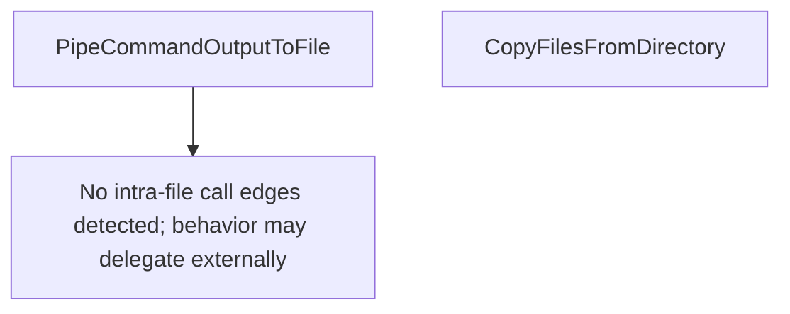

# Behavior Atom: diagnostic/log_collector_utils.go

## Source Anchor

- Go source: [cloudflare/cloudflared@2026.3.0/diagnostic/log_collector_utils.go](https://github.com/cloudflare/cloudflared/blob/2026.3.0/diagnostic/log_collector_utils.go)
- Package: diagnostic
- Module group: diagnostic

## Behavioral Responsibility

Management, diagnostics, and observability behavior.

## Entry Points

- PipeCommandOutputToFile(command *exec.Cmd, outputHandle*os.File) (*LogInformation, error) (line 11)
- CopyFilesFromDirectory(path string) (string, error) (line 69)

## Internal Function Surface

- None detected.

## Input Contract

- func-param:command *exec.Cmd
- func-param:outputHandle *os.File
- func-param:path string

## Output Contract

- filesystem writes
- return:*LogInformation
- return:error
- return:string

## Side Effects and State Transitions

- filesystem I/O
- subprocess execution

## Branching and Failure Semantics

- Branch density: if=12, switch=0, select=0
- error-return paths

## Import and Dependency Surface

- fmt
- io
- os
- os/exec
- path/filepath

## Go-Impl Flow (Intra-file)

## Rust Porting Notes

- **Subprocess output piping**: `PipeCommandOutputToFile` → `tokio::process::Command::new(cmd).stdout(Stdio::piped())` + `tokio::io::copy(&mut stdout, &mut file).await`.
- **Recursive file copy**: `CopyFilesFromDirectory` → `walkdir::WalkDir` + `tokio::fs::copy()` per file.
- **Quirk — 12 if-branches**: Error handling for subprocess + file I/O; chain with `?`.

## Accuracy Notes

- Generated from Go AST parsing and source text pattern extraction.
- Source link is authoritative for disputed semantics; keep this atom synchronized with the linked file.
