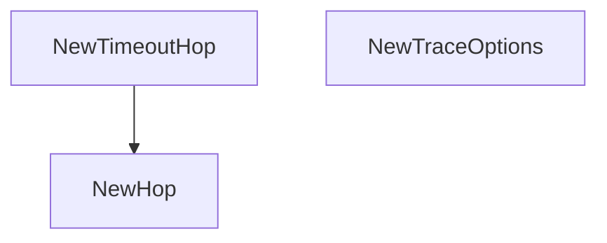

# Behavior Atom: diagnostic/network/collector.go

## Source Anchor

- Go source: [cloudflare/cloudflared@2026.3.0/diagnostic/network/collector.go](https://github.com/cloudflare/cloudflared/blob/2026.3.0/diagnostic/network/collector.go)
- Package: diagnostic
- Module group: diagnostic

## Behavioral Responsibility

Management, diagnostics, and observability behavior.

## Entry Points

- NewTimeoutHop(hop uint8) *Hop (line 34)
- NewHop(hop uint8, domain string, rtts []time.Duration) *Hop (line 47)
- NewTraceOptions(ttl uint64, timeout time.Duration, address string, useV4 bool) TraceOptions (line 55)

## Internal Function Surface

- None detected.

## Input Contract

- func-param:address string
- func-param:domain string
- func-param:hop uint8
- func-param:rtts []time.Duration
- func-param:timeout time.Duration
- func-param:ttl uint64
- func-param:useV4 bool

## Output Contract

- return:*Hop
- return:TraceOptions

## Side Effects and State Transitions

- No high-signal side effect pattern detected in static scan.

## Branching and Failure Semantics

- Branch density: if=0, switch=0, select=0
- No explicit failure pattern markers found in static scan.

## Import and Dependency Surface

- context
- errors
- time

## Go-Impl Flow (Intra-file)

## Rust Porting Notes

- **Traceroute data types**: `Hop`, `TraceOptions` → `struct Hop { ttl: u8, addr: IpAddr, rtt: Duration }` with `Serialize` derive.
- **Quirk — zero branching**: Data definitions only; direct translation.

## Accuracy Notes

- Generated from Go AST parsing and source text pattern extraction.
- Source link is authoritative for disputed semantics; keep this atom synchronized with the linked file.
