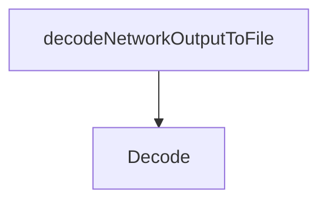

# Behavior Atom: diagnostic/network/collector_utils.go

## Source Anchor

- Go source: [cloudflare/cloudflared@2026.3.0/diagnostic/network/collector_utils.go](https://github.com/cloudflare/cloudflared/blob/2026.3.0/diagnostic/network/collector_utils.go)
- Package: diagnostic
- Module group: diagnostic

## Behavioral Responsibility

Management, diagnostics, and observability behavior.

## Entry Points

- Decode(reader io.Reader, decodeLine DecodeLineFunc) ([]*Hop, error) (line 45)

## Internal Function Surface

- decodeNetworkOutputToFile(command *exec.Cmd, decodeLine DecodeLineFunc) ([]*Hop, string, error) (line 13)

## Input Contract

- func-param:command *exec.Cmd
- func-param:decodeLine DecodeLineFunc
- func-param:reader io.Reader

## Output Contract

- return:[]*Hop
- return:error
- return:string

## Side Effects and State Transitions

- subprocess execution

## Branching and Failure Semantics

- Branch density: if=7, switch=0, select=0
- error-return paths

## Import and Dependency Surface

- bufio
- bytes
- fmt
- io
- os/exec

## Go-Impl Flow (Intra-file)

## Rust Porting Notes

- **Decoder callback**: `DecodeLineFunc` function pointer for line parsing → `Fn(&str) -> Result<Hop>` trait bound or generic parameter.
- **Buffered reader**: Reads subprocess output line-by-line → `tokio::io::BufReader::new(stdout).lines()` stream.
- **Quirk — 7 if-branches**: Error handling per line; use `filter_map` on line iterator to skip unparseable lines.

## Accuracy Notes

- Generated from Go AST parsing and source text pattern extraction.
- Source link is authoritative for disputed semantics; keep this atom synchronized with the linked file.
