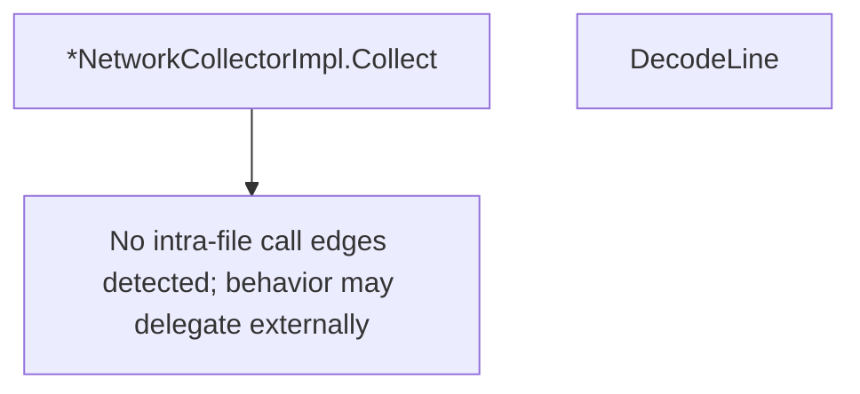

# Behavior Atom: diagnostic/network/collector_windows.go

## Source Anchor

- Go source: [cloudflare/cloudflared@2026.3.0/diagnostic/network/collector_windows.go](https://github.com/cloudflare/cloudflared/blob/2026.3.0/diagnostic/network/collector_windows.go)
- Package: diagnostic
- Module group: diagnostic

## Behavioral Responsibility

Management, diagnostics, and observability behavior.

## Entry Points

- (*NetworkCollectorImpl) Collect(ctx context.Context, options TraceOptions) ([]*Hop, string, error) (line 16)
- DecodeLine(text string) (*Hop, error) (line 37)

## Internal Function Surface

- None detected.

## Input Contract

- func-param:ctx context.Context
- func-param:options TraceOptions
- func-param:text string

## Output Contract

- return:*Hop
- return:[]*Hop
- return:error
- return:string

## Side Effects and State Transitions

- subprocess execution

## Branching and Failure Semantics

- Branch density: if=6, switch=0, select=0
- error-return paths

## Import and Dependency Surface

- context
- fmt
- os/exec
- strconv
- strings
- time

## Go-Impl Flow (Intra-file)

## Rust Porting Notes

- **tracert parsing**: Parses Windows `tracert` output format → `regex::Regex` with Windows-specific hop line pattern.
- **Build tag**: `//go:build windows` → `#[cfg(target_os = "windows")]`.
- **Quirk — 6 if-branches**: Line validation; same approach as Unix variant with Windows-specific patterns.

## Accuracy Notes

- Generated from Go AST parsing and source text pattern extraction.
- Source link is authoritative for disputed semantics; keep this atom synchronized with the linked file.
