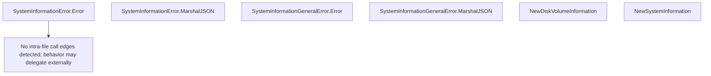

# Behavior Atom: diagnostic/system_collector.go

## Source Anchor

- Go source: [cloudflare/cloudflared@2026.3.0/diagnostic/system_collector.go](https://github.com/cloudflare/cloudflared/blob/2026.3.0/diagnostic/system_collector.go)
- Package: diagnostic
- Module group: diagnostic

## Behavioral Responsibility

Management, diagnostics, and observability behavior.

## Entry Points

- (SystemInformationError) Error() string (line 15)
- (SystemInformationError) MarshalJSON() ([]byte, error) (line 19)
- (SystemInformationGeneralError) Error() string (line 35)
- (SystemInformationGeneralError) MarshalJSON() ([]byte, error) (line 58)
- NewDiskVolumeInformation(name string, maximum uint64, current uint64) *DiskVolumeInformation (line 87)
- NewSystemInformation(memoryMaximum uint64, memoryCurrent uint64, filesMaximum uint64, filesCurrent uint64, osystem string, name string, osVersion string, osRelease string, architecture string, cloudflaredVersion string, goVersion string, goArchitecture string, disk []*DiskVolumeInformation)*SystemInformation (line 111)

## Internal Function Surface

- None detected.

## Input Contract

- func-param:architecture string
- func-param:cloudflaredVersion string
- func-param:current uint64
- func-param:disk []*DiskVolumeInformation
- func-param:filesCurrent uint64
- func-param:filesMaximum uint64
- func-param:goArchitecture string
- func-param:goVersion string
- func-param:maximum uint64
- func-param:memoryCurrent uint64
- func-param:memoryMaximum uint64
- func-param:name string
- func-param:osRelease string
- func-param:osVersion string
- func-param:osystem string

## Output Contract

- return:*DiskVolumeInformation
- return:*SystemInformation
- return:[]byte
- return:error
- return:string

## Side Effects and State Transitions

- No high-signal side effect pattern detected in static scan.

## Branching and Failure Semantics

- Branch density: if=8, switch=0, select=0
- error-return paths

## Import and Dependency Surface

- context
- encoding/json
- errors
- strings

## Go-Impl Flow (Intra-file)

## Rust Porting Notes

- **System info types**: `SystemInformation`, `DiskVolumeInformation` → Rust structs with `#[derive(Serialize, Deserialize)]`.
- **Error JSON marshaling**: Custom error serialization → implement `Serialize` on error types or use `#[serde(serialize_with)]`.
- **Quirk — 8 if-branches**: Optional field handling; use `Option<T>` fields with `#[serde(skip_serializing_if = "Option::is_none")]`.

## Accuracy Notes

- Generated from Go AST parsing and source text pattern extraction.
- Source link is authoritative for disputed semantics; keep this atom synchronized with the linked file.
