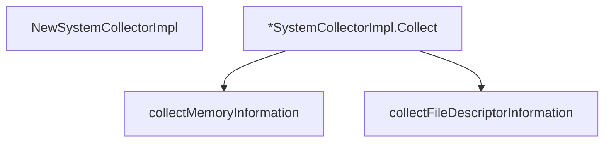

# Behavior Atom: diagnostic/system_collector_linux.go

## Source Anchor

- Go source: [cloudflare/cloudflared@2026.3.0/diagnostic/system_collector_linux.go](https://github.com/cloudflare/cloudflared/blob/2026.3.0/diagnostic/system_collector_linux.go)
- Package: diagnostic
- Module group: diagnostic

## Behavioral Responsibility

Management, diagnostics, and observability behavior.

## Entry Points

- NewSystemCollectorImpl(version string) *SystemCollectorImpl (line 18)
- (*SystemCollectorImpl) Collect(ctx context.Context) (*SystemInformation, error) (line 26)

## Internal Function Surface

- collectMemoryInformation(ctx context.Context) (*MemoryInformation, string, error) (line 96)
- collectFileDescriptorInformation(ctx context.Context) (*FileDescriptorInformation, string, error) (line 130)

## Input Contract

- func-param:ctx context.Context
- func-param:version string

## Output Contract

- return:*FileDescriptorInformation
- return:*MemoryInformation
- return:*SystemCollectorImpl
- return:*SystemInformation
- return:error
- return:string

## Side Effects and State Transitions

- subprocess execution

## Branching and Failure Semantics

- Branch density: if=8, switch=0, select=0
- error-return paths

## Import and Dependency Surface

- context
- fmt
- os/exec
- runtime
- strconv
- strings

## Go-Impl Flow (Intra-file)

## Rust Porting Notes

- **procfs parsing**: Reads `/proc/meminfo`, `/proc/fd` → `procfs` crate (e.g. `procfs::Meminfo::new()`) or manual `/proc` parsing via `tokio::fs::read_to_string()`.
- **Subprocess invocation**: System info via `uname`, `lsb_release` → `tokio::process::Command`.
- **Build tag**: `//go:build linux` → `#[cfg(target_os = "linux")]`.
- **Quirk — 8 if-branches**: procfs parse errors; use `?` operator.

## Accuracy Notes

- Generated from Go AST parsing and source text pattern extraction.
- Source link is authoritative for disputed semantics; keep this atom synchronized with the linked file.
