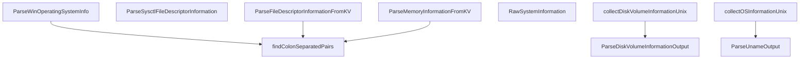

# Behavior Atom: diagnostic/system_collector_utils.go

## Source Anchor

- Go source: [cloudflare/cloudflared@2026.3.0/diagnostic/system_collector_utils.go](https://github.com/cloudflare/cloudflared/blob/2026.3.0/diagnostic/system_collector_utils.go)
- Package: diagnostic
- Module group: diagnostic

## Behavioral Responsibility

Management, diagnostics, and observability behavior.

## Entry Points

- ParseDiskVolumeInformationOutput(output string, skipLines int, scale float64) ([]*DiskVolumeInformation, error) (line 64)
- ParseUnameOutput(output string, system string) (*OsInfo, error) (line 125)
- ParseWinOperatingSystemInfo(output string, architectureKey string, osSystemKey string, osVersionKey string, osReleaseKey string, nameKey string) (*OsInfo, error) (line 163)
- ParseSysctlFileDescriptorInformation(output string) (*FileDescriptorInformation, error) (line 213)
- ParseFileDescriptorInformationFromKV(output string, fileDescriptorMaximumKey string, fileDescriptorCurrentKey string) (*FileDescriptorInformation, error) (line 249)
- ParseMemoryInformationFromKV(output string, memoryMaximumKey string, memoryAvailableKey string, mapper func(field string) (uint64, error)) (*MemoryInformation, error) (line 286)
- RawSystemInformation(osInfoRaw string, memoryInfoRaw string, fdInfoRaw string, disksRaw string) string (line 309)

## Internal Function Surface

- findColonSeparatedPairs(output string, keys []string, mapper func(string) (V, error)) map[string]V (line 13)
- collectDiskVolumeInformationUnix(ctx context.Context) ([]*DiskVolumeInformation, string, error) (line 339)
- collectOSInformationUnix(ctx context.Context) (*OsInfo, string, error) (line 359)

## Input Contract

- func-param:architectureKey string
- func-param:ctx context.Context
- func-param:disksRaw string
- func-param:fdInfoRaw string
- func-param:fileDescriptorCurrentKey string
- func-param:fileDescriptorMaximumKey string
- func-param:keys []string
- func-param:mapper func(field string) (uint64, error)
- func-param:mapper func(string) (V, error)
- func-param:memoryAvailableKey string
- func-param:memoryInfoRaw string
- func-param:memoryMaximumKey string
- func-param:nameKey string
- func-param:osInfoRaw string
- func-param:osReleaseKey string
- func-param:osSystemKey string
- func-param:osVersionKey string
- func-param:output string
- func-param:scale float64
- func-param:skipLines int
- func-param:system string

## Output Contract

- return:*FileDescriptorInformation
- return:*MemoryInformation
- return:*OsInfo
- return:[]*DiskVolumeInformation
- return:error
- return:map[string]V
- return:string

## Side Effects and State Transitions

- subprocess execution

## Branching and Failure Semantics

- Branch density: if=29, switch=0, select=0
- error-return paths

## Import and Dependency Surface

- context
- fmt
- os/exec
- runtime
- sort
- strconv
- strings

## Go-Impl Flow (Intra-file)

## Rust Porting Notes

- **Generic KV parser**: `findColonSeparatedPairs[V]` uses Go generics for typed parsing → `fn parse_kv_pairs<V: FromStr>(input: &str) -> HashMap<String, V>` with Rust generics.
- **Disk/memory parsing**: `ParseDiskVolumeInformationOutput`, `ParseMemoryInformationFromKV` → line-by-line parsing with `str::split_once(':')` and `str::parse::<u64>()`.
- **Quirk — 29 if-branches**: Extensive validation for each parsed field; use `Option::and_then()` chains or the `nom` parser combinator crate.

## Accuracy Notes

- Generated from Go AST parsing and source text pattern extraction.
- Source link is authoritative for disputed semantics; keep this atom synchronized with the linked file.
