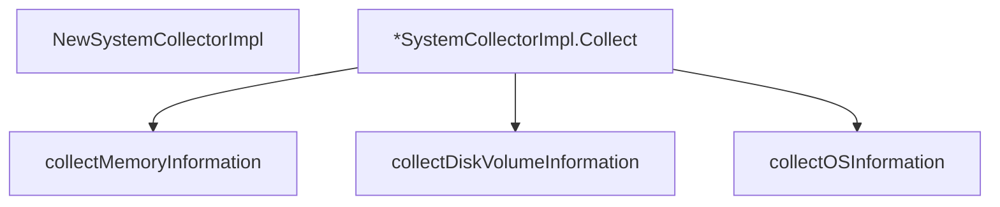

# Behavior Atom: diagnostic/system_collector_windows.go

## Source Anchor

- Go source: [cloudflare/cloudflared@2026.3.0/diagnostic/system_collector_windows.go](https://github.com/cloudflare/cloudflared/blob/2026.3.0/diagnostic/system_collector_windows.go)
- Package: diagnostic
- Module group: diagnostic

## Behavioral Responsibility

Management, diagnostics, and observability behavior.

## Entry Points

- NewSystemCollectorImpl(version string) *SystemCollectorImpl (line 19)
- (*SystemCollectorImpl) Collect(ctx context.Context) (*SystemInformation, error) (line 27)

## Internal Function Surface

- collectMemoryInformation(ctx context.Context) (*MemoryInformation, string, error) (line 92)
- collectDiskVolumeInformation(ctx context.Context) ([]*DiskVolumeInformation, string, error) (line 129)
- collectOSInformation(ctx context.Context) (*OsInfo, string, error) (line 152)

## Input Contract

- func-param:ctx context.Context
- func-param:version string

## Output Contract

- return:*MemoryInformation
- return:*OsInfo
- return:*SystemCollectorImpl
- return:*SystemInformation
- return:[]*DiskVolumeInformation
- return:error
- return:string

## Side Effects and State Transitions

- subprocess execution

## Branching and Failure Semantics

- Branch density: if=9, switch=0, select=0
- error-return paths

## Import and Dependency Surface

- context
- fmt
- os/exec
- runtime
- strconv

## Go-Impl Flow (Intra-file)

## Rust Porting Notes

- **WMI queries**: `wmic` command invocation for system info → `wmi` crate for native WMI access on Windows, or `tokio::process::Command::new("wmic")` for subprocess fallback.
- **Build tag**: `//go:build windows` → `#[cfg(target_os = "windows")]`.
- **Quirk — 9 if-branches**: WMI output parsing; use structured `wmi` crate queries with `serde` deserialization.

## Accuracy Notes

- Generated from Go AST parsing and source text pattern extraction.
- Source link is authoritative for disputed semantics; keep this atom synchronized with the linked file.
