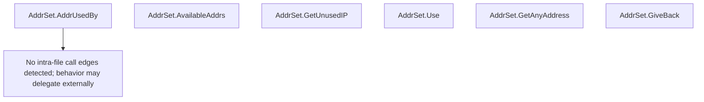

# Behavior Atom: edgediscovery/allregions/address.go

## Source Anchor

- Go source: [cloudflare/cloudflared@2026.3.0/edgediscovery/allregions/address.go](https://github.com/cloudflare/cloudflared/blob/2026.3.0/edgediscovery/allregions/address.go)
- Package: allregions
- Module group: edgediscovery

## Behavioral Responsibility

Core package behavior anchored to this source file.

## Entry Points

- (AddrSet) AddrUsedBy(connID int) *EdgeAddr (line 9)
- (AddrSet) AvailableAddrs() int (line 19)
- (AddrSet) GetUnusedIP(excluding *EdgeAddr)*EdgeAddr (line 31)
- (AddrSet) Use(addr *EdgeAddr, connID int) (line 41)
- (AddrSet) GetAnyAddress() *EdgeAddr (line 49)
- (AddrSet) GiveBack(addr *EdgeAddr) ok bool (line 58)

## Internal Function Surface

- None detected.

## Input Contract

- func-param:addr *EdgeAddr
- func-param:connID int
- func-param:excluding *EdgeAddr

## Output Contract

- return:*EdgeAddr
- return:int
- return:ok bool

## Side Effects and State Transitions

- No high-signal side effect pattern detected in static scan.

## Branching and Failure Semantics

- Branch density: if=5, switch=0, select=0
- No explicit failure pattern markers found in static scan.

## Import and Dependency Surface

- No imports.

## Go-Impl Flow (Intra-file)

## Rust Porting Notes

- **AddrSet map**: `map[*EdgeAddr]UsedBy` for address tracking → `HashMap<EdgeAddr, UsedBy>` (no pointer indirection needed).
- **Pure data structure**: Direct translation; no concurrency or I/O.

## Accuracy Notes

- Generated from Go AST parsing and source text pattern extraction.
- Source link is authoritative for disputed semantics; keep this atom synchronized with the linked file.
