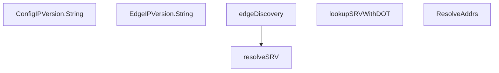

# Behavior Atom: edgediscovery/allregions/discovery.go

## Source Anchor

- Go source: [cloudflare/cloudflared@2026.3.0/edgediscovery/allregions/discovery.go](https://github.com/cloudflare/cloudflared/blob/2026.3.0/edgediscovery/allregions/discovery.go)
- Package: allregions
- Module group: edgediscovery

## Behavioral Responsibility

Core package behavior anchored to this source file.

## Entry Points

- (ConfigIPVersion) String() string (line 46)
- (EdgeIPVersion) String() string (line 68)
- ResolveAddrs(addrs []string, log *zerolog.Logger) resolved []*EdgeAddr (line 197)

## Internal Function Surface

- edgeDiscovery(log *zerolog.Logger, srvService string) ([][]*EdgeAddr, error) (line 112)
- lookupSRVWithDOT(srvService string, srvProto string, srvName string) (cname string, addrs []*net.SRV, err error) (line 153)
- resolveSRV(srv *net.SRV) ([]*EdgeAddr, error) (line 172)

## Input Contract

- func-param:addrs []string
- func-param:log *zerolog.Logger
- func-param:srv *net.SRV
- func-param:srvName string
- func-param:srvProto string
- func-param:srvService string

## Output Contract

- return:[]*EdgeAddr
- return:[][]*EdgeAddr
- return:addrs []*net.SRV
- return:cname string
- return:err error
- return:error
- return:resolved []*EdgeAddr
- return:string
- stdout/stderr or structured logs

## Side Effects and State Transitions

- network I/O

## Branching and Failure Semantics

- Branch density: if=10, switch=2, select=0
- error-return paths
- fallback/default branches

## Import and Dependency Surface

- context
- crypto/tls
- fmt
- github.com/cloudflare/cloudflared/management
- github.com/pkg/errors
- github.com/rs/zerolog
- net
- time

## Go-Impl Flow (Intra-file)

## Rust Porting Notes

- **SRV + DNS-over-TLS**: `lookupSRVWithDOT` using `crypto/tls` for DNS resolution → `hickory_resolver::TokioAsyncResolver` with TLS transport config.
- **Iota enums**: `ConfigIPVersion`, `EdgeIPVersion` with switch dispatch → Rust enums with `match`.
- **Quirk — 10 if-branches**: DNS fallback logic; use `Result` chain with fallback via `.or_else()`.

## Accuracy Notes

- Generated from Go AST parsing and source text pattern extraction.
- Source link is authoritative for disputed semantics; keep this atom synchronized with the linked file.
