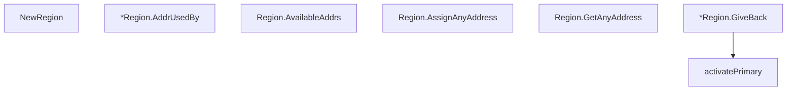

# Behavior Atom: edgediscovery/allregions/region.go

## Source Anchor

- Go source: [cloudflare/cloudflared@2026.3.0/edgediscovery/allregions/region.go](https://github.com/cloudflare/cloudflared/blob/2026.3.0/edgediscovery/allregions/region.go)
- Package: allregions
- Module group: edgediscovery

## Behavioral Responsibility

Core package behavior anchored to this source file.

## Entry Points

- NewRegion(addrs []*EdgeAddr, overrideIPVersion ConfigIPVersion) Region (line 21)
- (*Region) AddrUsedBy(connID int)*EdgeAddr (line 77)
- (Region) AvailableAddrs() int (line 86)
- (Region) AssignAnyAddress(connID int, excluding *EdgeAddr)*EdgeAddr (line 93)
- (Region) GetAnyAddress() *EdgeAddr (line 102)
- (*Region) GiveBack(addr*EdgeAddr, hasConnectivityError bool) ok bool (line 108)

## Internal Function Surface

- activatePrimary(r *Region) (line 151)

## Input Contract

- func-param:addr *EdgeAddr
- func-param:addrs []*EdgeAddr
- func-param:connID int
- func-param:excluding *EdgeAddr
- func-param:hasConnectivityError bool
- func-param:overrideIPVersion ConfigIPVersion
- func-param:r *Region

## Output Contract

- return:*EdgeAddr
- return:Region
- return:int
- return:ok bool

## Side Effects and State Transitions

- No high-signal side effect pattern detected in static scan.

## Branching and Failure Semantics

- Branch density: if=10, switch=3, select=0
- fallback/default branches

## Import and Dependency Surface

- time

## Go-Impl Flow (Intra-file)

## Rust Porting Notes

- **Dual address sets**: Primary/secondary `AddrSet` with failover logic → struct with two `HashMap` fields + `enum RegionPreference`.
- **Activation delay**: `time.After` timer for re-activating primary → `tokio::time::sleep()` or `tokio::time::Instant`.
- **Quirk — 3 switch + 10 if-branches**: Failover state machine; model as explicit `enum FailoverState` with `match`.

## Accuracy Notes

- Generated from Go AST parsing and source text pattern extraction.
- Source link is authoritative for disputed semantics; keep this atom synchronized with the linked file.
