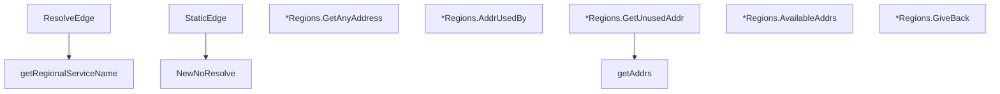

# Behavior Atom: edgediscovery/allregions/regions.go

## Source Anchor

- Go source: [cloudflare/cloudflared@2026.3.0/edgediscovery/allregions/regions.go](https://github.com/cloudflare/cloudflared/blob/2026.3.0/edgediscovery/allregions/regions.go)
- Package: allregions
- Module group: edgediscovery

## Behavioral Responsibility

Core package behavior anchored to this source file.

## Entry Points

- ResolveEdge(log *zerolog.Logger, region string, overrideIPVersion ConfigIPVersion) (*Regions, error) (line 22)
- StaticEdge(hostnames []string, log *zerolog.Logger) (*Regions, error) (line 38)
- NewNoResolve(addrs []*EdgeAddr)*Regions (line 48)
- (*Regions) GetAnyAddress()*EdgeAddr (line 70)
- (*Regions) AddrUsedBy(connID int)*EdgeAddr (line 79)
- (*Regions) GetUnusedAddr(excluding*EdgeAddr, connID int) *EdgeAddr (line 88)
- (*Regions) AvailableAddrs() int (line 121)
- (*Regions) GiveBack(addr*EdgeAddr, hasConnectivityError bool) bool (line 127)

## Internal Function Surface

- getAddrs(excluding *EdgeAddr, connID int, first*Region, second *Region)*EdgeAddr (line 107)
- getRegionalServiceName(region string) string (line 135)

## Input Contract

- func-param:addr *EdgeAddr
- func-param:addrs []*EdgeAddr
- func-param:connID int
- func-param:excluding *EdgeAddr
- func-param:first *Region
- func-param:hasConnectivityError bool
- func-param:hostnames []string
- func-param:log *zerolog.Logger
- func-param:overrideIPVersion ConfigIPVersion
- func-param:region string
- func-param:second *Region

## Output Contract

- return:*EdgeAddr
- return:*Regions
- return:bool
- return:error
- return:int
- return:string
- stdout/stderr or structured logs

## Side Effects and State Transitions

- No high-signal side effect pattern detected in static scan.

## Branching and Failure Semantics

- Branch density: if=12, switch=0, select=0
- error-return paths

## Import and Dependency Surface

- fmt
- github.com/rs/zerolog
- math/rand

## Go-Impl Flow (Intra-file)

## Rust Porting Notes

- **Multi-region broker**: Two `Region` instances with randomized selection via `math/rand` → `rand::thread_rng().gen_range()` for random region pick.
- **Address allocation**: Round-robin across regions per HA connection → index-based region selection.
- **Quirk — 12 if-branches**: Exhaustion checks; return `Option<EdgeAddr>` for empty pools.

## Accuracy Notes

- Generated from Go AST parsing and source text pattern extraction.
- Source link is authoritative for disputed semantics; keep this atom synchronized with the linked file.
