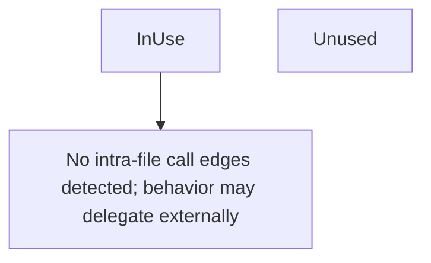

# Behavior Atom: edgediscovery/allregions/usedby.go

## Source Anchor

- Go source: [cloudflare/cloudflared@2026.3.0/edgediscovery/allregions/usedby.go](https://github.com/cloudflare/cloudflared/blob/2026.3.0/edgediscovery/allregions/usedby.go)
- Package: allregions
- Module group: edgediscovery

## Behavioral Responsibility

Core package behavior anchored to this source file.

## Entry Points

- InUse(connID int) UsedBy (line 8)
- Unused() UsedBy (line 12)

## Internal Function Surface

- None detected.

## Input Contract

- func-param:connID int

## Output Contract

- return:UsedBy

## Side Effects and State Transitions

- No high-signal side effect pattern detected in static scan.

## Branching and Failure Semantics

- Branch density: if=0, switch=0, select=0
- No explicit failure pattern markers found in static scan.

## Import and Dependency Surface

- No imports.

## Go-Impl Flow (Intra-file)

## Rust Porting Notes

- **Tagged union**: `InUse(connID)` vs `Unused` → `enum UsedBy { InUse(u32), Unused }`. Trivial direct translation.

## Accuracy Notes

- Generated from Go AST parsing and source text pattern extraction.
- Source link is authoritative for disputed semantics; keep this atom synchronized with the linked file.
